## Advanced Software Engineering Zusammenfassung Simon

---

# Patterns 
## Definition
>Design Patterns sind bewährte Lösungsschablonen für wiederkehrende Entwurfsprobleme.
>> **Für Simon => Patterns sind low level also Proxy z.B. ist keine API weil das schon viel zu weit Abstrahiert ist**

## Eigenschaften
- ein oder mehrere Probleme lösen
- ein erprobtes Konzept bieten
- auf realen Designs basieren
- über das rein Offensichtliche hinausgehen
- Beziehungen aufzeigen, die tiefergehende Strukturen und Mechanismen eines Systems umfassen
## Implementierung
>Ein Pattern ist ein abstrakter Lösungsentwurf, welcher verschiedene Designs haben kann. Diese können unterschiedlich designt werden und diese Designs können jeweils wieder unterschiedlich implementiert werden.
<!--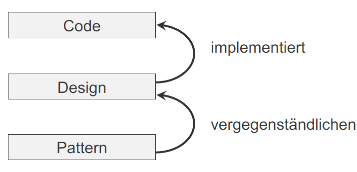-->


## Einteilung von Patterns
>Patterns können in drei Kathegorien unterschieden werden 
- Creational
- Structural
- Behavioral

### Creational Patterns
Dienen der Erzeugung von Objekten => Entkoppeln die Konstruktion eines Objekts von seiner Repräsentation

### Structural Patterns
Bieten vorgefertigte Schablonen für Beziehungen zwischen Klassen
### Behavioral Patterns
Modellieren komplexes Verhalten der Software und erhöhen damit die Flexibilität der Software hinsichtlich ihres Verhaltens

Patterns manifestieren sich auf Klassenebene (Benutzung von Vererbung) und auf Objektebene (Benutzung von Interfaces)
Patterns auf Objekt-Ebene sind viel gebräuchlicher, da sie zu pflegbarerem Code führen
- Replacement Principle = Interna der Implementierung können jederzeit geändert werden

Die Verwendung von Patterns erhöht meist die Komplexität des Entwurfs bzw. der Implementierung
- Durch Hilfsklassen/Interfaces => Führt (oft) zu schwer wartbarem Code

**Der Entwurf sollte immer so einfach wie möglich sein, aber nicht einfacher und nur so komplex wie unbeding nötig!**

---

# Creational Patterns 
Der Vorteil objektorientierter Sprachen sind Klassen und verwendung von Polymorphie (Bsp. abstrakte Schnittstellen)
**Problem:** Polymorphie funktioniert nicht bei der Erzeugung von konkreten Objekten. Hier muss jedes mal Explizit der Typ angegeben werden.

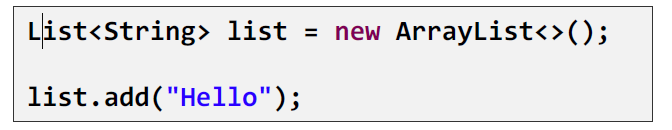

## Factory Pattern
> Eine einfache Variante ist die Bereitstellung von Erzeugungsmethoden, welche ein Objekt des gewünschten Typs zurückgeben
```java
public final class ListFactory
{
    private ListFactory( ) {}
    public static <T> List<T> newArrayList()
    {
        return new ArrayList<T>();
    }
    public static <T> List<T> newLinkedList()
    {
        return new LinkedList<T>();
    }
}
```

## Abstract Factory Pattern
> Über spezielle Objekte (sogenannte abstract Factories) soll der Erzeugungskontext automatisch ermittelt werden

Dabei wird per Interface eine Methode welche das Objekt bereitstellt erzeugt und jedes Objekt welches von diesem Interface erbt stellt die jeweilig benötigte Implementierung bereit.
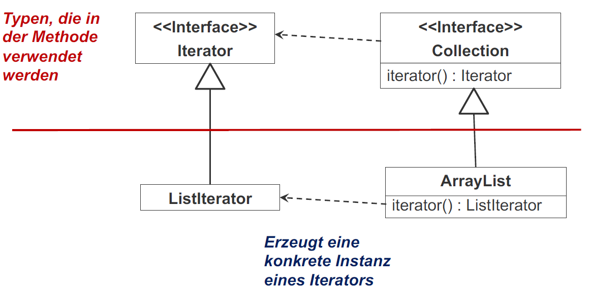

### Beispiel zwei überlappende Factories

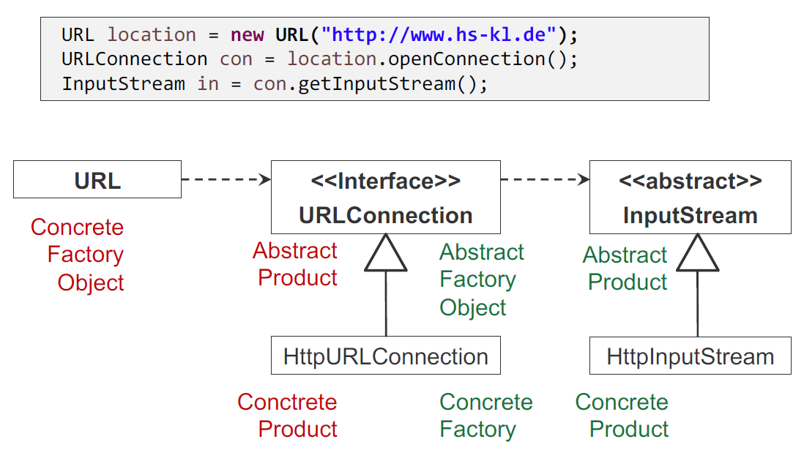

## Builder Pattern

Das Builder Pattern soll die Konstruktion eines Objektes von seiner Repräsentation trennen. Dadurch kann das gleiche Erstellungsverfahren unterschiedliche Arten und Darstellungen von Objekten erzeugen.

> **Problem**: Wenn mehrere ähnliche Konstruktorparameter gesetzt werden sollen müssen diese im Konstruktor klar definiert sein! Gerade in Java kann der Konstruktor die unterschiedlichen Parameter nicht anhand des Namens sondern nur anhand des Datentyps unterscheiden.
```java
class A{
    A(int a, b){}
    A(int b, c){} //Fehler
    A(int a, c){} //Fehler
}
```
>Per Setter Methoden könnte jeder Parameter einzeln gesetzt werden, was jedoch eine große Fehlerquelle darstellt, da die Initialisierung eines Objektes über mehrere Zeilen geschehen müsste.

Das Builder Pattern löst dieses Problem indem es indem innerhalb einer Klasse eine interne Builderklasse erzeugt wird. Diese erhält für jeden Parameter der Klasse ein äquivalent und wird an den Konstruktor der zu bauenden Klasse übergeben. 
>Dadurch ist es möglich die Hauptklasse immutable zu halten und jedem Parameter unabhängig voneinander konfigurieren zu können.

```java
Class A{
    private int a;
    private int b;
    private int c;
    A(ABuilder builder){
        this.a = builder.a;
        this.b = builder.b;
        this.c = builder.c;
    }
    class ABuilder{
        int a = 0;
        int b = 0;
        int c = 0;
        public ABuilder setA(int a){
            this.a = a;
            return this;
        }
        public ABuilder setB(int b){
            this.b = b;
            return this;
        }
        public ABuilder setC(int c){
            this.c = c;
            return this;
        }
        Public A build(){
            return new A(this);
        }
    }
}
```
Daraus ergibt sich der Aufruf
```java
A a = new A.ABuilder().setA(1).setB(2).setC(3).build();
```

## Singleton
> Das Singleton-Pattern besagt, dass höchstens ein Objekt der Klasse existieren darf.
>> In der Regel soll von überall auf das Objekt zugegriffen werden können(Global Accessible) => **Das Singleton ist keine globale Variable!**

**Lazy Implementierung**
>**nicht** thread-safe!
```java
public class Singleton {
    private static Singleton instance;
    private Singleton() { }
    public static Singleton getInstance()
    {
        if( instance == null )
        {
            instance = new Singleton();
        }
        return instance;
    }
}
```
**Eager Implementierung**
>thread-safe
>> Instanziierung an das Laden der Klasse gebunden
```java
public class Singleton
{
    private static Singleton instance = new Singleton();
    private Singleton() { }
    public static Singleton getInstance()
    {
        return instance;
    }
}
```
**Implementierung mit Holder-Klasse**
>**Java only**

Erzeugung des Singletons an das Laden der internen Klasse gebunden
```java
public class HolderSingleton
    {
    public static class Holder
    {
    private static HolderSingleton instance = new HolderSingleton();
    }
    public static HolderSingleton getInstance()
    {
        return Holder.instance;
    }
    private HolderSingleton() { }
}
```
## Prototype Pattern
>Copy & Paste & Modify

Es existiert ein vorgefertigtes Objekt, welches entsprechend seiner angezielten Nutzung konfiguriert wird.

# Structural Patterns

Structural Patterns kommen zur Compilezeit und beschreiben die Beziehungen zwischen Objekten

## Adapter Pattern
Den Adapter gibt es in zwei Versionen(Objekt-Adapter / Klassen-Adapter)

>Lollypop Schnittstelle -o )-

Adapter werden verwendet um zwei nicht miteinander kompatible Objekte/Schnittstellen miteinander kompatibel zu machen.
> []-o )-[]-o )-[]

> **Kompatibilität zwischen Schnittstellen => Keine neue Funktionalität => Nur eine Delegation**
### Objekt-Adapter
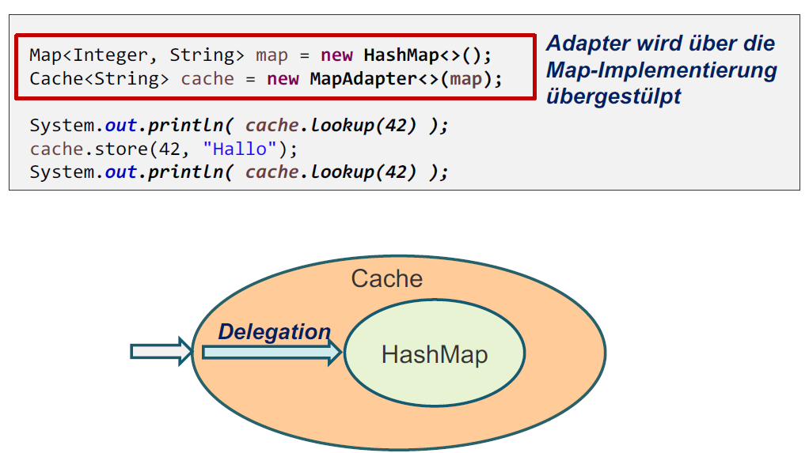

### Klassen-Adapter
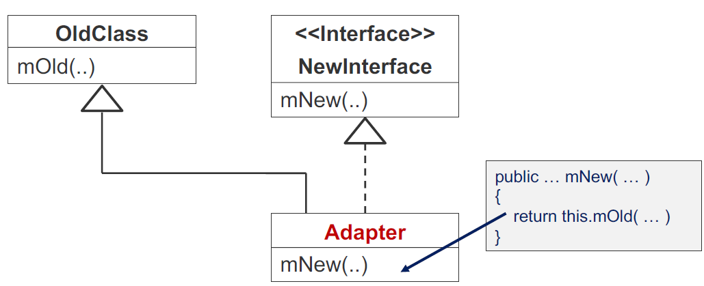

## Decorator

>*"Ich habe ein Objekt welches ich funktional erweitere => Ich füge Funktionalität hinzu behalte aber den Typ bei"*

Unterschied zu Wrapper = Wrapper fügt in Java keine Funktionalität hinzu
Wrapper = Typkonvertierung 

Decorator erweitert Objekt und bestimmte Funktionalitäten => Pizza/Visierbeispiel da das Objekt beliebig "Dekoriert" werden kann

Problem bei Decorator => **Großer Vererbungszweig/Vererbungsbäume entstehen**

Dekoratoren werden oft in Ketten Organisiert

(Dekorator 1) -> (Dekorator 2) -> (Dekorator 3) -> (Konkretes Objekt)

> Wichtig ist, dass jeder Operator so behandelt werden kann wie das Objekt **Austauschbarkeit**

Kein Referenzvergleich == mehr möglich 
Gleichheit und Hashvalue müssen angepasst werden.

> Das hat den Hintergrund da hier die Fragestellung aufkommt was wird verglichen (Das Originalobjekt oder die Decoration)

Erzeugung von Decoratoren wird meist durch Factories implementiert

Dekoratoren verdecken die Objekt-ID des ursprünglichen Objekts

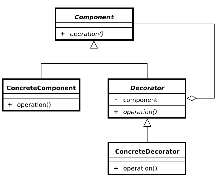

## Decorator vs Adapter

Dekorator erweiter Funktionalität der Schnittstelle
Adapter verbindet zwei nicht kompatible Schnittstellen (interface mix-in)

## Proxy

Stellvertreter Objekt um zu verhindern, dass ein direkter Zugriff auf ein Objekt entsteht

Remote Proxy: Bsp. Remote Zugriff auf ein Objekt 

P1  Netzwerk P2
[] - () - []

Um von P1 in Daten von P2 Zugriff zu bekommen baue ich einen Stellvertreter in P1 welcher auf die Objekte in P2 per Netzwerkrequest zugreifen kann

>**Nicht Read-Only** Per Set Methode können die Daten in P2 auch bearbeitet werden
>>Es geht also nur um den stellvertretenden Zugriff auf ein Fremdes Objekt ohne direkten Zugriff auf das Objekt zu haben.

>(alt)RMI / (neu)REST

*"Transportiert die Schnittstelle wo anders hin. Schreiber/Leser merkt nicht, dass er mit dem Proxy kommuniziert"*

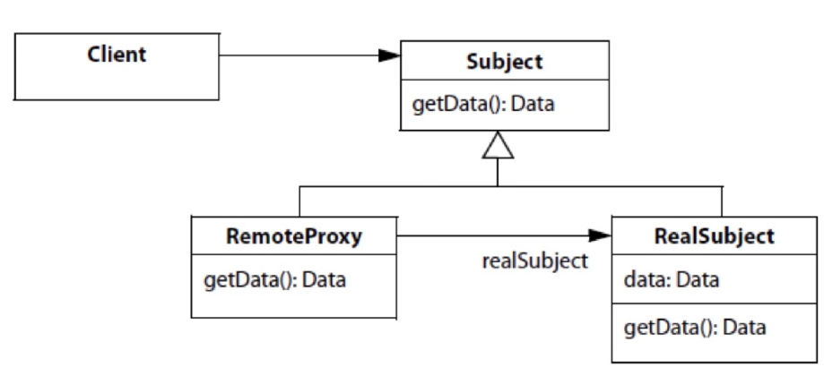

## Adapter vs. Decorator vs. Proxy

Adapter = Überbrückung zweier Schnittstellen
Decorator = Erweitert Verhalten des ursprünglichen Objekts
Proxy = Besitzt selbe Schnittstelle und zeigt selbes Verhalten wie das "abgeschirmte" Objekt


## Bridge Pattern
>*"Wenn sie Bridge Pattern hören denken sie immer an die golden gate Brigde, sie verbinden zwei Landzungen" => "Adapter für Klassenhierarchien"*

Das Bridge Pattern wird dafür verwendet größere Schnittstellen miteinander zu verbinden.

>*"Sind nichts anderes als Treiber wie zum Beispiel JPA oder JDBC also ein Großer Adapter zwischen Abstraktion und bestimmten Implementierungen"*
>>*"Schnittstelle auf der einen Seite mit einer großen Hierarchie wird adaptiert durch Implementierungen"*

<div style="display: flex; justify-content: space-around;">
    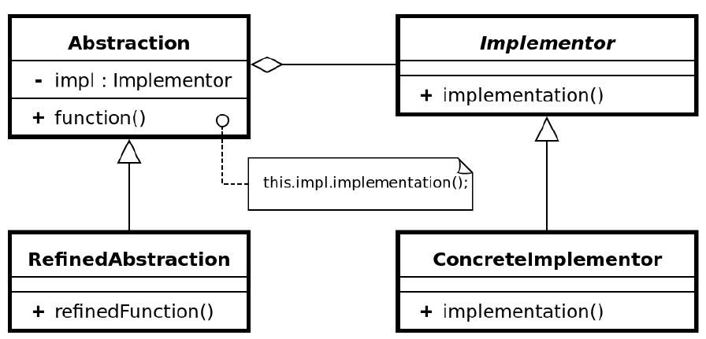
    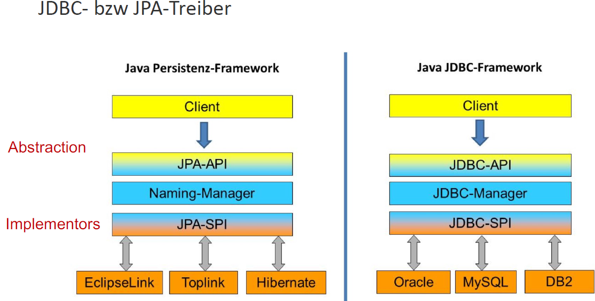
</div>

## Facade / Fassade

>*"Man baut was schönes und verbirgt dahinter was anderes. Also man macht nach außen was schönen hin weil man nach innen was verbergen möchte"*

Konkret Komplizierte Klassenkonstrukte die nach außen hin schön erreichbar gemacht werden soll => Schnittstelle

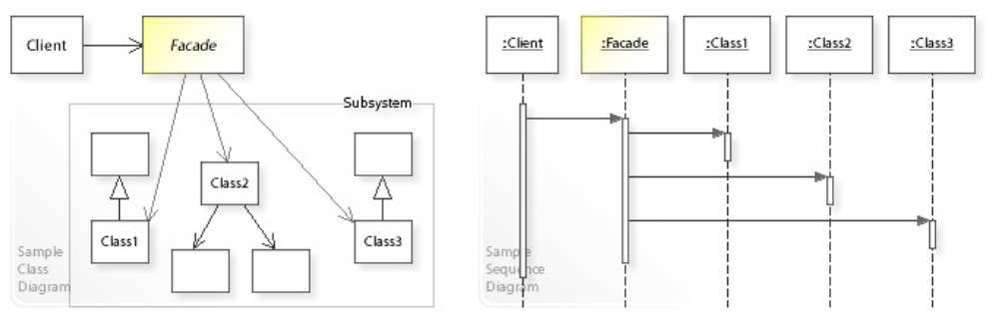

### Vorteile

Vereinfacht:
- komplexes Domain Model

- Austausch von Implementierungen

### Nachteile
- Mutieren oft zu Monsterklassen

Facade = Keine Isolierung des Sub-Systems "Concevience Einstellung" => Soll idR. Zugriffe auf dahinterliegende Objekte zulassen und erleichtern
> Einfache Zugriffsschnittstelle für komplexere Aufrufe

## Composit 

Composite-Pattern = hierarschicher Aufbau einer Datenstruktur (Repräsentation einer Teil-Ganzes-Hierarchie)

**Einsatzzweck:**
- Aufbau einer flexiblen hierarchischen Struktur, deren Gestalt sich ändern kann
- Bestandteile können einheitlich behandelt werden, da sie einen algemeinen Typ repräsentieren

> **Knoten kann wieder Knoten enthalten Bsp. Baum-Datenstruktur, Dateisystem**


# Behavioral Patterns

Helfen das komplexe Verhalten von Software besser zu modellieren => erhöht Flexibilität der Software

## Command

Implementierung von Arbeitsanweisungen als Objekt anstatt als Methode. Wenn es also eine abstrakte Klasse Command gibt die eine Methode execute() vorgibt können alle erstellten Commands übergeben werden. Meistens gibt es einen Invoker, welcher den Befehl ausführt und einen Receiver welcher die Arbeit "verrichtet".

>**IntUnaryOperator** = Damit können Lambdaausdrücke genutzt werden 
```Java
public static void main(String[] args)
{
    System.out.println("Summe " + sum(0,10, i -> i) );
    System.out.println("Summe Quadratzahlen " + sum(0,10, i -> i*i) );
}
private static int sum(int start, int end, IntUnaryOperator function)
{
    int sum = 0;
    for(int i=start; i < end; i++)
    {
        sum += function.applyAsInt(i);
    }
    return sum;
}
```

### Erweiterungen
#### Command Stack

Bsp. Realisierung einer Undo Funktionalität
> Im Kontext von Tastatureingaben würde der CommandStack per undo dann per Strg+Z zurückabgearbeitet

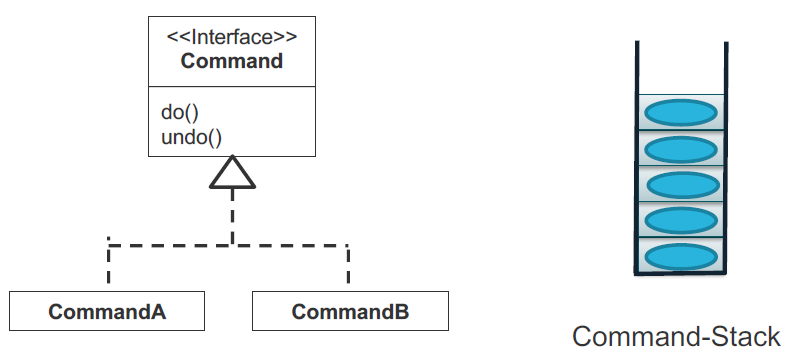

#### Command-Broker

Es gibt einen Command Handler dieser sucht sich einen passenden 
Commandhandler aus und übergibt diesem die Aufgabe

In manchen Implementierungen übernimmt Commandbroker Aufgabe selbst
In manchen übergibt er diese Aufgabe an einen Commandhandler

Executoren entsprechen Execution-Brokers 
=> Executor Service = Command Pattern

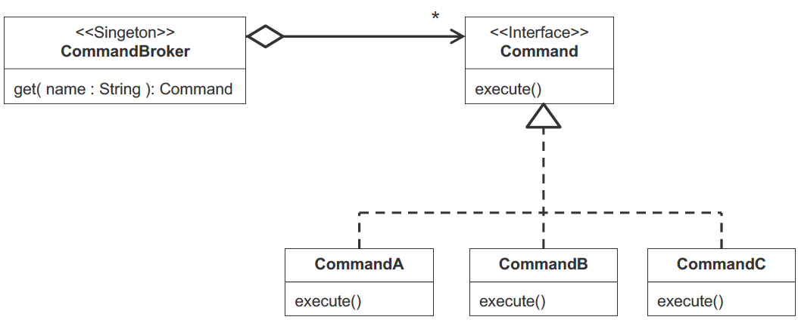

## State Pattern

Endlicher Automat (Einfach nur eine endliche Menge von Zuständen die halt bei Input wechseln)
Beispiele für State Machines:
- TCP = Wird als State Machine erzeugt
- Digitaluhr

### Prozedurale implementierungsvariante 
> Aktueller Zustand => Ereignis => Bedingung/Folgezustand
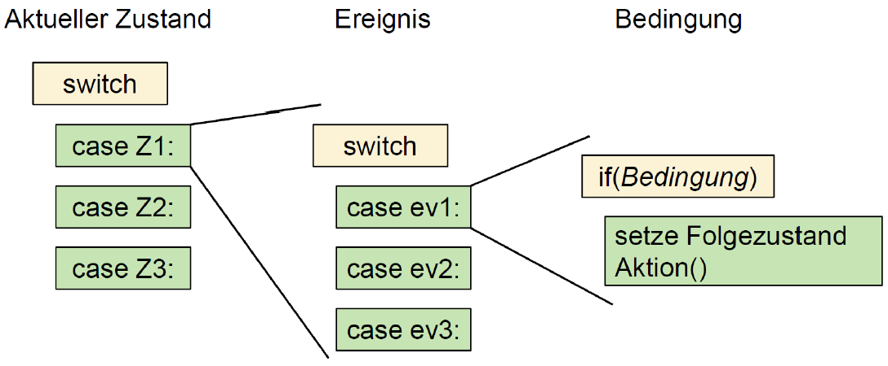

Vorteil = Ablauforientiert "Das Bild (der Zustandsautomat) verschwindet"
```Java
while (index < eventSequenz.length()) {
    char event = eventSequenz.charAt(index);
    switch (state) {
        case "Q1":
            switch (event) {
                case 'a': state = "Q2"; break;
                case 'b': state = "Q1"; break;
                default: System.err.println("Falsches Event");
            }
        break;
        case "Q2":
            …..
        case "Q3":
            …..
        default: System.err.println("Falscher Zustand");
    }
```
Dieser Ansatz ist jedoch Zeitaufwendig, da jede Verzweigung angepasst werden muss, sobald ein neuer Zustand dazu kommt.

### Implementierungsart mit Zustandsklassen
> "Das Bild (Zustandsklassen) bleibt" => Man ist näher am Bild dran was es leichter/verständlicher macht

> Implementierungsvariante als Graph
>> Knoten und Kanten => Zustand hat mehrere Knoten für jedes Event
>>> - Knoten = Zustandsübergänge
>>> - Kanten = Zustände
>> - Hier baut man dann die Struktur nach Also State a hat Übergang zu B, C, D
>> - Bsp Web oder Webframework => Wenn ich auf Taste drücke geh ich da hin

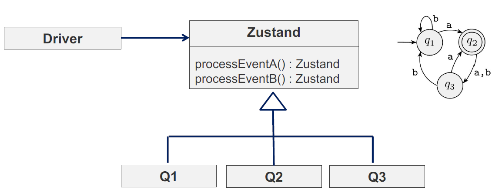

```Java
public class Q1 extends Zustand
{
    @Override
    public Zustand processEventA() { return new Q2(); }
    @Override
    public Zustand processEventB() { return this; }
}
public static void main(String[] args)
{
    Zustand state = new Q1();
    state = state.processEventA().processEventB().processEventA();
    System.out.println( state.getClass().getSimpleName() );
}
```

### Graph Implementierung


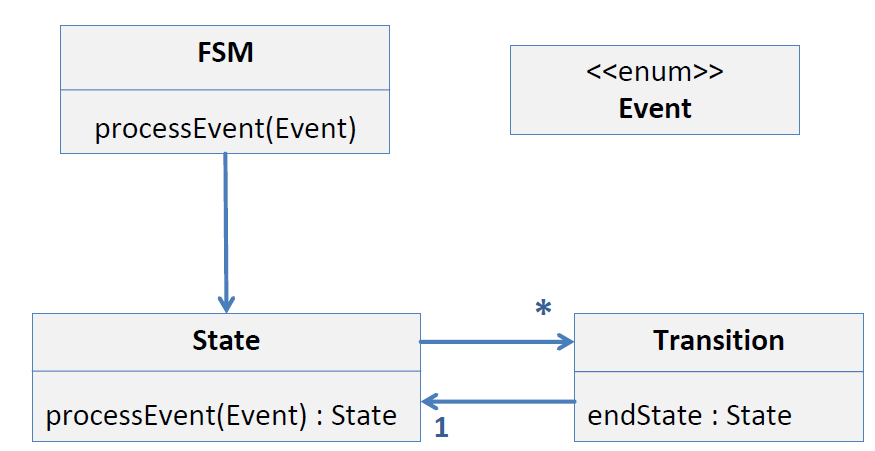

Wenn man von außen Parameter konfigurieren will nimmt man die Graph Implementierung
> Hier müssen erstmal die Grundlagen gemacht werden, Transitionsmodelle, etc.

## Template Method

Die Template Methode ist ein Basisbeispiel der Polymorhie [^1]. 
Hier implementiert eine abstrakte Klasse Figur eine Methode um diese Figur zu zeichnen. Da jedoch alle Klassen die von Figur erben eigene Formen darstellen müssen diese unterschiedlich gezeichnet werden. Dafür wird die in Figur deklarierte draw-Methode in jeder erbenden Klasse konkret implementiert.

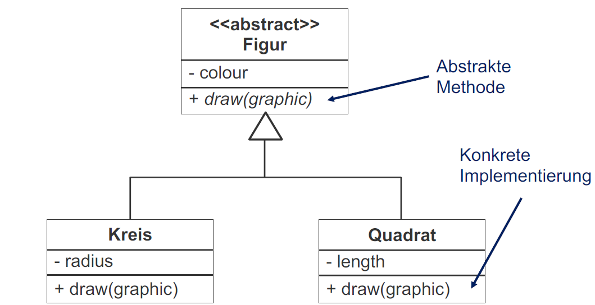

## Problem 1: Die konkrete Implementierung von draw() benötigt einen Zugriff auf den Farbwert

### Lösung 1: Implementierung eines Farbattributes
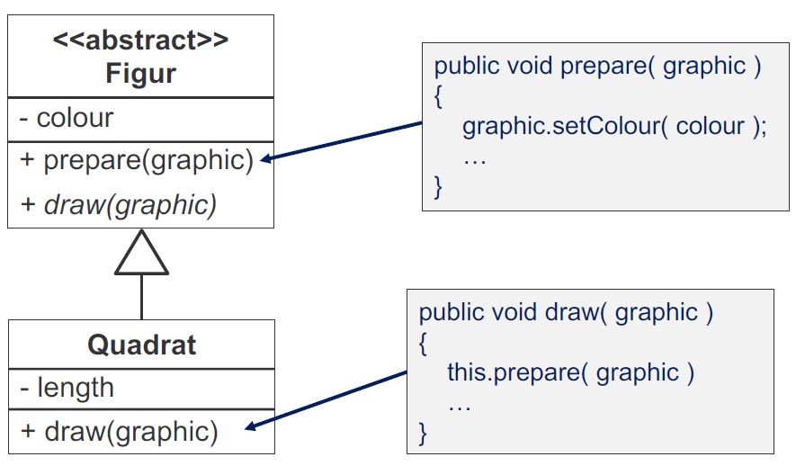

Hier ergibt sich der Nachteil, dass in jeder Implementierung von draw der prepare-Aufruf vergessen werden kann => **Komplexität wird erhöht**

### Lösung 2: Implementierung einer getColor() Methode

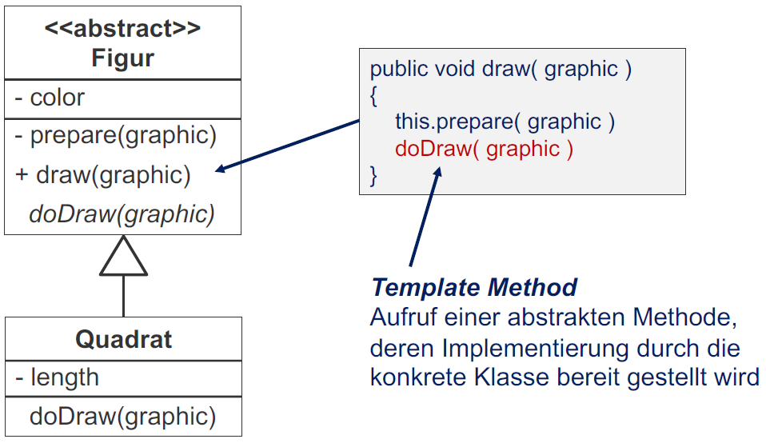

Die Oberklasse gesaltet hier den allgemeinen Ablauf des Zeichnens, beschreibt aber nicht das spezifische Zeichnen der einzelnen Figuren.
- Durch die prepare() Methode, welche in der Oberklasse implementiert wird werden alle Parameter(Farbe) gesetzt, diese bleibt den Unterklassen verborgen.
- doDraw() ist eine abstrakte Methode die von den Unterklassen überschrieben werden muss, hier wird die Logik für die spezifischen Figuren definiert.
=> Simpel gesagt es wird nur die draw()-Methode der Oberklasse aufgerufen welche "versteckt" die abstrakte Methode doDraw() aufruft. Da doDraw() abstract ist muss jede Klasse die von Figur erbt diese für sich implementieren. Dadurch ist es möglich draw() immer aufzurufen, da bei Aufruf die Farbwerte von der Oberklasse gesetzt und die doDraw von der erbenden Klasse bereitgestellt wird.

> Beispiel aus der Vorlesung: Temperatursensor der sich immer wieder von Version zu Version verändert
>> Lösung abstrakte Funktion getTemp() <br>
>> Jeder Sensor implementiert getTemp() so wie er funktioniert. Dadurch kann jeder Sensor verwendet werden ohne bei Versionswechsel immer wieder den Code ändern zu müssen

> Template Pattern basiert auf Polymorphie / Baut darauf auf

## Strategy

Erlaubt den Austausch/Konfiguration eines Algorithmus oder Verfahrens zu Laufzeit.
Machbar wenn mehrere Algorithmen-Verfahren zur verfügung stehen.

*"Wenn sie etwas sortieren wollen können sie den Sortieralgorithmus austauschen"*

1. Bsp Comparator => Anhand des Vergleichs bzw der Implementierung des Comparators ist die Logig verändert
    - Man übergibt dem Sortieralgorithmus eine Strategie => Die Entscheidung wann etwas größer/kleiner ist wird verändert
2. Bsp. Baum-Beispiel
    - Wie durch den Baum iteriert("Traversiert") wird kann anhand einer übergebenen Strategie festgelegt. => Man gibt einem Algorithmus eine Strategie mit und verändert dadurch die Logik/Ausführung

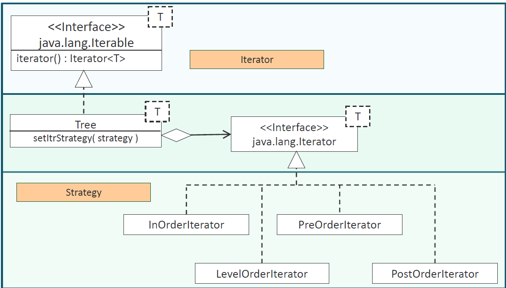

## Observer
"**Das wichtigste und komplizierteste Pattern**"

"Ihr Code den sie lesen wird nicht in der Reihenfolge ausgeführt wie sie ihn lesen. Durch Callback Methoden die Aufgerufen werden wenn ein Event ausgelöst wird"

Es gibt ein Observable 
- register() => Dort registrieren sich die Listener "adListener"
- deregister() => Deregisteirung
- notify() => Läuft durch alle Observer und ruft dort eine Methode (meistens action() o.ä.) auf

> **Das Observer-Pattern dient der automatischen Weitergabe von Änderungen an einem Objekt an von diesem Objekt abhängige Strukturen**

Man unterscheidet in drei Arten das Observer-Pattern umzusetzen

- Push Notification
    - Observer bekommt Nachricht es hat sich was geändert und muss aktiv nachfragen was/wie sich etwas geändert hat
- Push Update
    - Push Update => Die geänderten Informationen werden mitgeschickt
- Pull Notification
    - Beobachter fragt selbstständig nach dem Zustand des Objektes

> **"MCV Pattern ist Observer => View ist Observer von Model"**
>> Model kennt View nicht dadurch sind die Views austauschbar
>> Dadurch lose kopplung

Controller = Zuständig für Eingaben

Lambdas = Kurzschreibweise um Interfaces mit nur einer Funktionalität aufzurufen
```Java
public interface TickerStateChangeListener {
    public void StateHasChanged();
}

//Dieser Aufruf ist dasselbe wie
this.ticker.registerStateChangeListener(new TickerStateChangeListener() {
            @Override
            public void StateHasChanged() {
                setDisplay(ticker.getValue());
            }
        });

// dieser Aufruf
this.ticker.registerStateChangeListener(() -> setDisplay(ticker.getValue()));
```

---

# Design Prinzipien

## SOLID

S = Single Responsibility Only

O = Open-Closed Prinzip

L = Liskovsches Substitutionsprinzip

I = Interface Segregation Prinzip

D = Dependency Inversion Prinzip

**Wenn jemand im Bewerbungsgesrpäch fragt muss man wissen, dass es ein Akronym ist und für Designprinzipien steht. Noch bessern wenn man diese Kennt**

### SRP: Single Responsibility Principle
- "Für was ist was zuständig"
- Eine Klasse/Funktion hat nur eine Funktionalität

"Es sollte nie mehr als einen Grund dafür geben, eine Klasse zu ändern"
=> Vermeidung von Seiteneffekten

Kann auf Klassen-, Methoden- und Komponentenebene angewendet werden.

> Dies ist wichtig, da wenn eine Klasse mehr als eine Zuständigkeit hat, dann werden auch diese welche bei der Nutzung dieser Klasse nicht benötigt werden implizit gekoppelt. Wenn nun eine dieser Zuständigkeiten verändert wird kann die Zuständigkeit der anderen beeinträchtigt oder behindert werden.

<div style="display: flex; justify-content: space-around;">
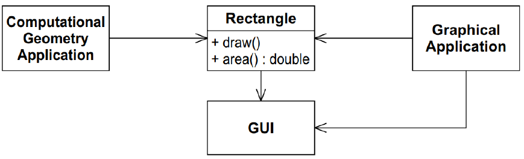
<div width=40><p>=></div>
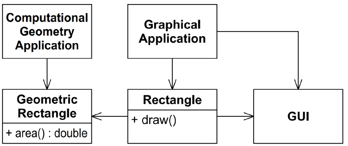
</div>

<br/>
Auf Komponentenebene wird SRP zum Common-Closure-Prinzip

Auf Architekturebene wird SRP zum Axis-of-Change-Modell

### OCP = Open Closed Principle

"Wie baue ich meine Software offen für Erweiterungen aber geschlossen für Veärnderungen"

**Open -> Erweiterung**
Das Verhalten eines Moduls bzw. einer Klasse soll erweitert werden können, wenn sich die Anforderungen der Anwendung ändern.
**Closed -> Veärnderungen**
Das Erweitern des Verhalten eines Moduls bzw. einer Klasse soll keine Änderungen am bestehenden Quellcode des Moduls beinhalten => Die ausführbare Version des Moduls/der Bibliothek bleibt unangetastet
> Die Erweiterungen sollen die Klasse nicht kaputt machen.

Änderungen sollten Lokal bleiben und keine Seiteneffekte haben.
Wenn ein starres Design vorliegt kann eine Änderung zu einer Kaskade von Änderungen führen.

<div style="display: flex; justify-content: space-around;"> 
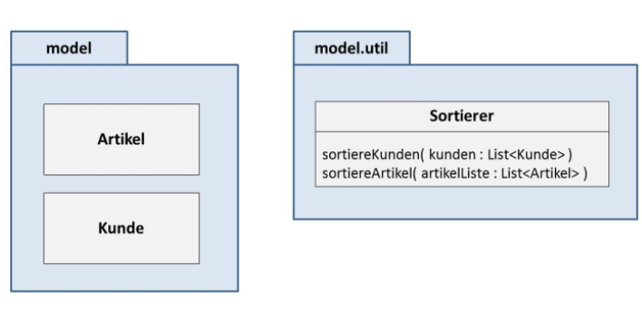
<div width=10><p>=></p></div>
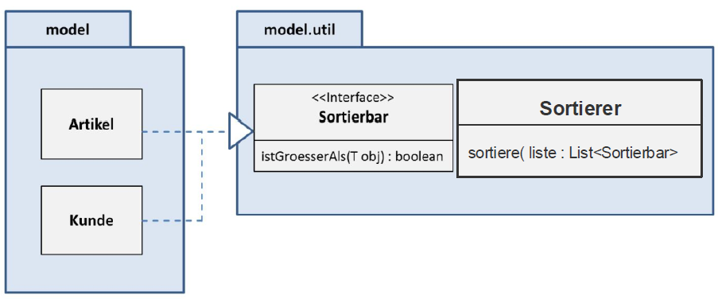
</div>
> In Beispiel 2 Liegt das Interface Sortierbar im model.util, da es zu dem Sortierer gehört. Wenn die Klassen den Sortierer nutzen wollen müssen sie auch das Interface unter dessen Hoheit implementieren.

Zielsetzung ist es, das System so zu gestalten, dass es leicht erweiterbar ist, ohne einen zu hohen Einfluss durch Modifikatoren zuzulassen.
Wird erreicht durch:
- Unterteilung des Systems in Komponenten
- Anordnung der Komponenten in einer Abhängigkeitshierarchie
- Komponenten niedrigerer Ebenen durch Änderungen von Komponenten höherer Hierarchien schützen

### Liskovsches Substitutionsprinzip
- "Leitlinie für Vererbung"
- Unterklassen müssen immer Oberklassen substituieren können

Vererbung bedeutet Substituierbarkeit und sollte nicht als eine ist-ein Beziehung interpretiert werden.

> Untergeordnete Klassen einer Vererbungshierarchie können die überliegenden vollständig ersetzen
### ISP = Interface Segregation Principle
"Clients sollten nicht gezwungen sein von Interfaces abzuhängen, die sie nicht verwenden"

**Unnötige Interfaceverkettungen oder große/riesige Interfaces vermeiden!**

>Machen sie kleine Interfaces => Interfaces sollten immer eine Rolle haben, welches das Objekt spielen kann

Simpel heruntergebrochen soll vermieden werden, dass eine Klasse ein großes Interface mit zu vielen Eigenschaften implementieren muss obwohl nur eine Eigenschaft dieses Interface implementiert werden soll.
Lösung = Implementierung mehrerer kleiner Interfaces die jeweils nur eine Eigenschaft verkörpern so, dass eine Klasse nur das implementiert was sie auch braucht.

### DIP = Dependency Inversion Principle
**Ganz wichtig!**
"Module hoher Ebenen sollten nicht von Modulen niedrigerer Ebenen abhängen. Beide sollten von Abstraktionen abhängen."
"Abstraktionen sollten nicht von Details abhängen => Details sollten von Abstraktionen abhängen!"

Beispiel für dieses Principle = Abstract Factory
=> Iterator weiß welche Datenstruktur vorliegt und kann passend zur Datenstruktur einen Iterator auswählen

DIP besagt, dass Systeme, in welchen sich Quellcode-Abhängigkeiten ausschließlich auf Abstraktionen beziehen anstatt auf konkrete Realisierungen, am flexibelsten sind.
=> "High-Level"(Layer) sollen nicht von "Low-Level"(konkrete Implementierungen) abhängig sein

> Dieses Prinzip uist nicht durchzuhalten! => Abhängigkeiten von stabilem konkreten Code sind erlaubt.

## API-Design
Benutzbarkeit = Leicht verstädnlich und erlernbar sein
Effizienz = geringe Übertragung von Datenvolumen
Zuverlässigkeit = Wie wird mit Fehlern umgegangen? => **Ein Fehler bei Verwendung sollte nicht in einem Absturz resultieren!**

**Wichtig:**
- Konsistenz = Durchgängige Namensgebung
- Verständlichkeit = Konventionen
    - Getter und Setter sollten auch so benannt sein (getId(), setId(int id))
- Eine gute API sollte schwer falsch zu benutzen sein!
    - Eine gute API sollte nicht nur einfach zu benutzen sein, sondern auch schwer sein sie falsch zu verwenden
- Leaking References vermeiden
    - Eine API sollte keine Referenzen zurückgeben (modifizierbare Interna)
    - Wenn eine beispielsweise eine Liste zurückgegeben wird sollte entweder eine Kopie dieser zurückgegeben werden oder eine unmodifizierbare Version.
- Keine null Rückgaben!
    - Lieber ein eigenen Typ/Fehler zurückgeben als stumpf null

## Weitere Konzepte

### DRY = Dont Repeat Yourself
Ziel Redundanz vermeiden und Funktionalität zentralisieren

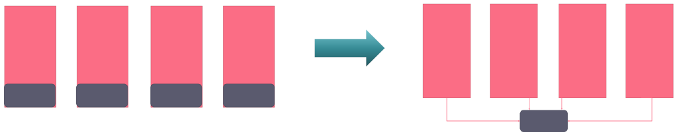

**Vorsicht: Kann Abhängigkeiten einführen**

### YAGNI = You Aren´t Gonna Need It

Unnötiges weglassen => Erst implementieren wenn es benötigt wird 

### KISS = Keep It Simple And Stupid

Einfachheit ist eine erforderliche Eigenschaft von Softwaresysteme
- Gilt für Gestaltung und Implementierung

Wenn Software kompliziertet ist als sie sein muss sinkte ihre Qualität

=> höhere Komplexität verringert Wartbarkeit, behindert Wiederverwendbarkeit und kann zu Zunahme der Anzahl von Fehlern führen.

## Fazit von Design Prinzipien
Die Anwendung der Prinzipien führt nicht automatisch zu besserer Software. Meistens landet man bei "es kommt darauf an!" abhängig von dem jeweiligen Fall.

# Architekturen für Verteilte Systeme

Verteiltes System = Zusmmenschluss unabhängiger Computer, die sich für den Benutzer als ein einziges System präsentieren.
- Menge interagierender Prozesse (oder Prozessoren), welche über keinen gemeinsamen Speicher verfügen und daher mit Nachrichten miteinander kommunizieren.

## Client-Server-System
Viele Clients greifen auf einen oder mehrere Server zu.

## Verteilte Anwendung
Durch die Programmierung der Anwendung wir das verteilte System erstellt.

## Verteiltes Betriebssystem
Das Betriebssystem selbst ist verteilt, für Benutzer und Anwendungen ist dies nicht sichtbar.

## Schichtenarchitektur

- Graphische Präsentation (Benutzeroberfläche)
- Benutzungsinterface (Interaktionssteuerung)
- Datenverarbeitung (Business-Logic)
- DBMS = Datenbankmanagementsystem
    - Datenmanagement
    - Daten

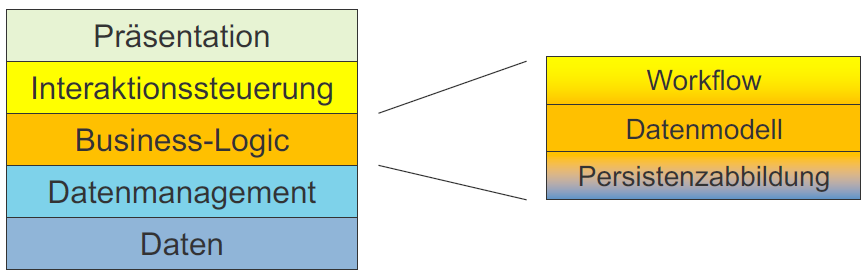

> Verstecken von Komplexität nach unten (Obere Schichten können nur auf Schicht untendrunter zugreifen (z.B. durch Observer) )

## Monolitische Systeme


### Standalone-Systeme = Alles auf einem Rechner

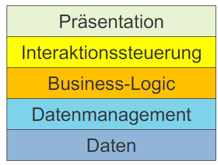

### Komplette Anwendung läuft zentral auf einem Server

Interaktive Benutzung nur über "dumme" Terminals

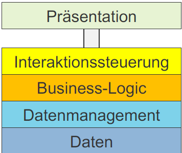

## Client/Server-Systeme

Leistungsfähige PCs ermöglichen Ausführung auf Nutzerrechnern
- Bsp. Fileserver, Datenbank-Server, Workflow-Engines

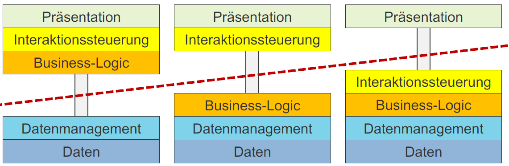

1. Logik auf Client
2. Logik in der Datenbank (Stored Procedures)
3. Logik und Anwendungssteuerung innerhalb des DBMS

## Klassische Two-Tier Architektur

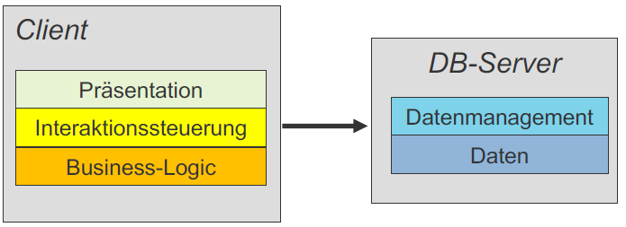

Vorteile
- Einfaches Programmiermodell
- Applikationslogik liegt hauptsächlich auf dem Client

Nachteile
- Hohe Anforderungen an die Client-Rechner (hohe Kosten)
- Nicht unbegrenzt skalierbar
- Softwareverteilungsproblem: Client-Versionen müssen alle synchron gehalten werden

## Verteilte-Anwendungen / Three-Tier / n-Tier Architekturen

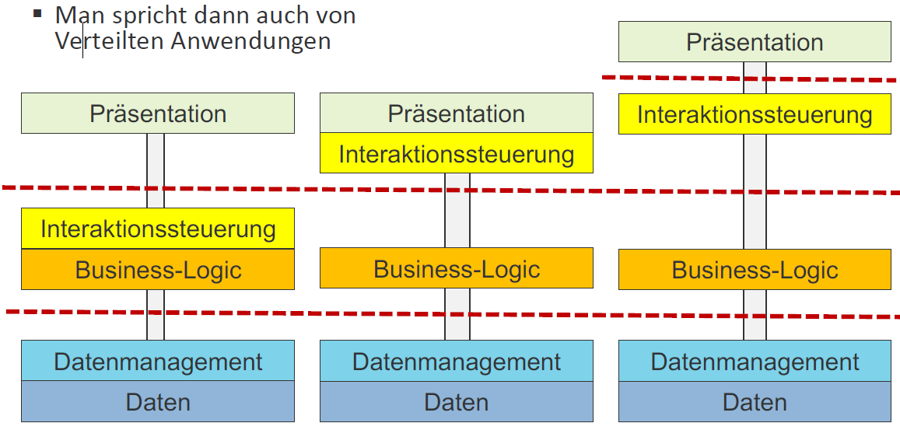

Verteilung bedeutet einfach nur, dass das Programm auf diverse Rechner verteilt wird.
Verteilung kann sowohl Vertikal, Horizontal als auch in beiden Dimensionen erfolgen.

Vertikale Verteilung = Schichten liegen auf unterschiedlichen Rechnern
Horizontale Verteilung = Anzahl der Schichten


Aufteilung in DB, Logik(Backend) und Presentation(Frontend)
> So funktionieren die meisten Webseiten/Systeme
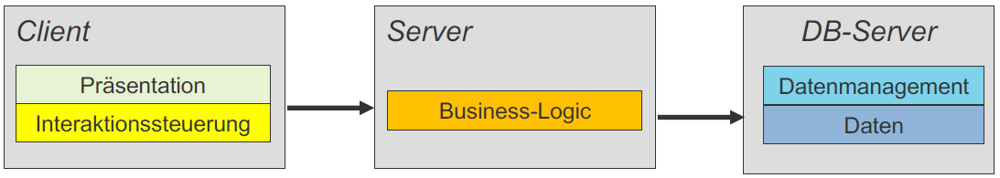 


## Middelware

Die Middleware liegt zwischen den Betriebssystemen (OS) der Rechner (Rechner A, B, C) und der verteilten Anwendung. Sie bietet Middleware-Services, die die Kommunikation und Koordination zwischen verschiedenen Rechnern in einem verteilten System ermöglichen.

- Namensdienst
- Kommunikationsdienst
- Filedienst
- Zeitdienst
- Konkurrenzdienst
- Transaktionsdienst
- Sicherheitsdienst

Zusammengefasst bieten Middleware-Services die Infrastruktur, die die Entwicklung und den Betrieb verteilter Anwendungen durch Standardfunktionen vereinfacht.

>Die Middleware kapselt die Anwendung von den benutzten Protokollschichten
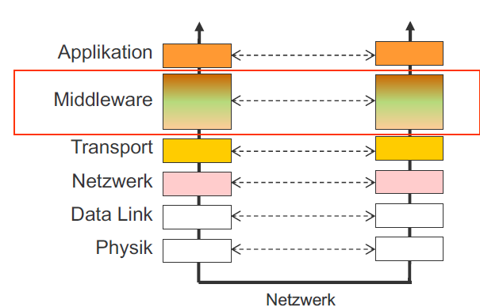

## Kommunikationsarten
<table>
<th>Synchron</th>
<th>Asynchron</th>
<tr>
<td>http, REST</td>
<td>fetch(JavaScript), JMS(Messaging)</td>
</tr>
</table>


<table>
<th>One-to-One</th>
<th>One-to-Many</th>
<tr>
<td>http, Rest, fetch, JMS mit Queues</td>
<td>Eventauslieferung beim Observer, JMS mit Topics</td>
</tr>
</table>

### Synchrone Kommunikation

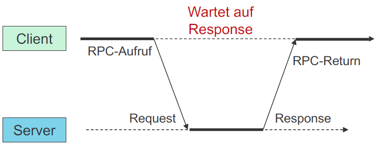

### Asynchrone Kommunikation 

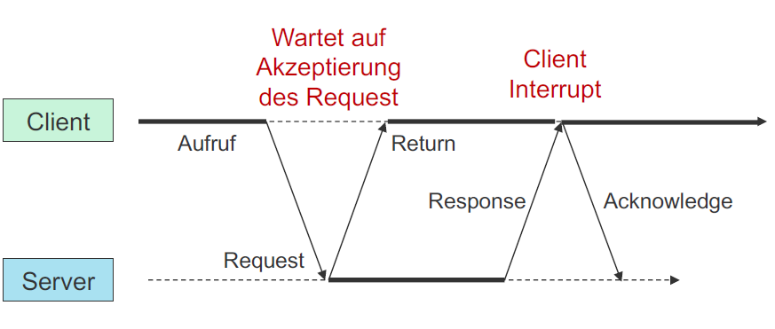


### Kommunikationsfehler

Mögliche Fehler:
- Request geht verloren oder wird verzögert
- Response geht verloren oder wird verzögert
- Client oder Server sind zwischenzeitlich nicht verfügbar

> Hier ist wichtig wie damit umgegangen wird. Wird ein Request erneut gesendet, wie lange wartet man auf die Antwort, etc.

# RMI (Remote Method Invocation)
RMI = Java-Mechanismus zur Realisierung der Interprozesskommunikation
Mit Hilfe von RMI können Methoden entfernter Objekte aufgerufen werden
> Ziel: Aufruf sollte dabei möglichst transparent sein

>**RMI nutzt Proxy Pattern**
>>Stub und Skeleton Repräsentieren die Platzhalter => Proxy


## Architektur von RMI

Server = Dienstanbieter
Client = Dienstnehmer

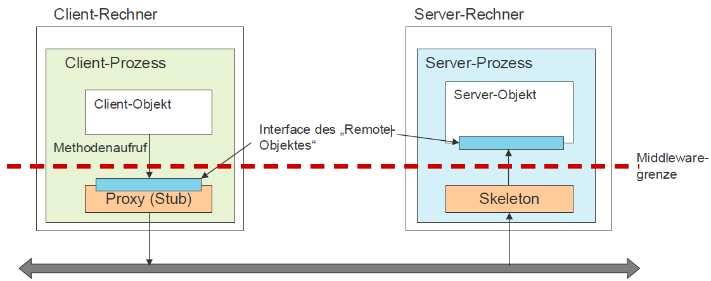

## Codebeispiel: Server 

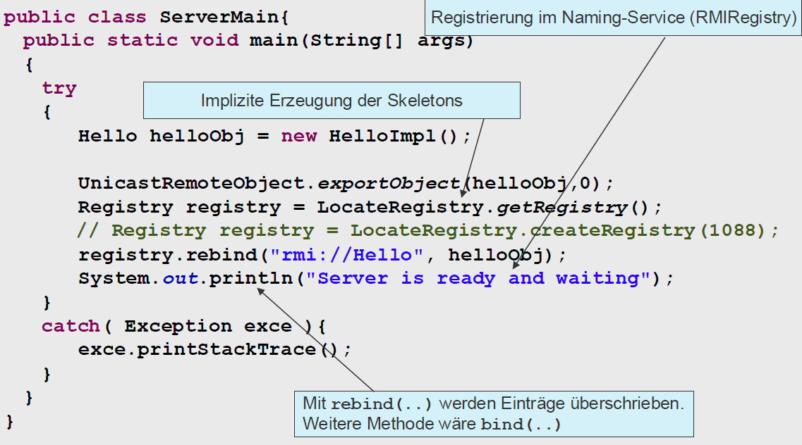

ExportObjekt => Erzeugt Skeleton und macht Sockel auf
LocateRegistry.getRegistry() => Sucht Naming Service (falls dieser nicht läuft Startet dieser).
Konvention Protokoll vorne anfügen (Bsp. "rmi://Hallo" und nicht "//Hallo")

rebind() überschreibt falls es den Aufruf schon gibt
bind() versucht Aufruf zu setzen und wirft Fehler, falls schon belegt

## Codebeispiel: Client

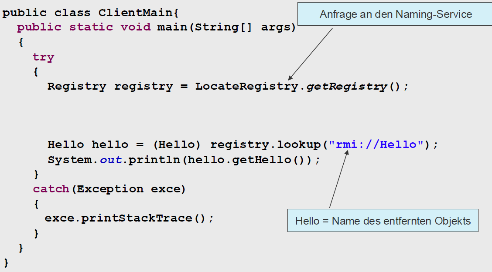

LocateRegistry.getRegistry() => Sucht Naming Service
registry.lookup("rmi://Hello"); => Ruft Hello von Remote Objekt auf

## Reihenfolge der Ausführung
- Starten der rmiregistry (in Shell)
    - rmiregistry repräsentiert Naming-Service
    - Remote-Interfaces müssen im rmiregistry-Classpath stehen
    - Am einfachsten startet man die rmiregistry im "Serververzeichnis"
- Starten des Servers (in Shell)
- Starten des Clients (in Shell)
    

## Middleware bei RMI
- Stub = Proxy => Macht Netzerkrequest 
- Skeleton = Socketlistener = Nimmt Netzwerkrequest entgegen und verwaltet das Serverobjekt

Mittleware = Vermittlungsschnittstelle welche möglichst transparent weggekapselt werden soll.

Wichtig ist, dass man bei RMI bei mehreren Parallelen Zugriffen auf den Server direkt im Multithreading ist und damit Concurrency Konflikte vermeiden muss!!!
=> **Nebenläufige Programmierung**
>Grund dafür ist, dass alle Threads Zugriff auf den Heap haben D.h. Heap-Variablen werden gemeinsam benutzt!

## Parameterübergabe
Bei RMI findet ein Remote Aufruf statt also ein Call by Value => Es werden Kopien des Objekts erzeugt

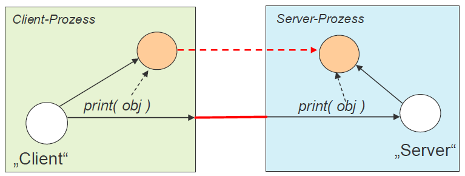

## Problem mit RMI: Request-Response
Request-Response Muster= Client stellt Request, Server reagiert darauf (Response)
- Server Kann Client nicht aktiv benachrichtigen

**Workaround: Callback Design Pattern** 
## Callback Design

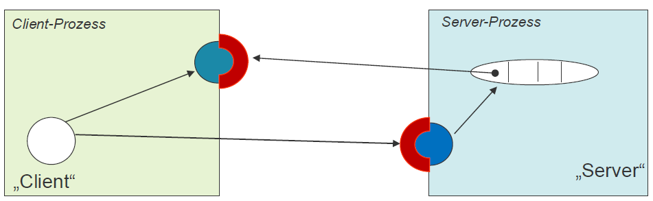

Client stellt auch Remote-Objekt zu Verfügung und gibt Server eine Referenz darauf

## Distributed Garbage Collection
Objekt darf erst gelöscht werden, wenn:
- keine lokalen Referenzen existieren
- keine entfernten Referenzen existieren

Zusätzlich kann mit Timeout gearbeitet werden.

## Java Naming and Directory Service
Bsp. für Naming Service = RMI_Registry
Naming Service enthält Name-Wert-Paare
- Namen sind eindeutig
- Werte stellen Ressourcen bzw. Objekte dar, welche gemeinsam genutzt werden sollen.

JNDI = Java Naming and Directory Interface 
- API welches die Möglichkeit bietet, Naming und Directory Service Funktionalitäten in Java Anwendungen zu nutzen.

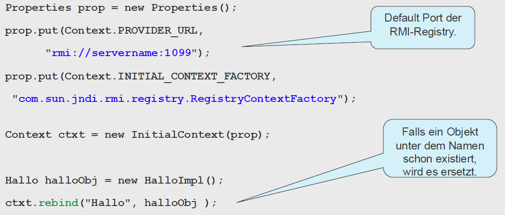

## Alternativen für RMI
CORBA (Common Object Request Broker Architekture)
Probleme mit CORBA => nicht Internettauglich


# Service Oriented Architekture (SOA)

**Idee der SOA = Schnittstellen werden zu standartisierten Services umfunktioniert**
> - allgemeine Mechanismen zur Beschreibung von Finden und Kommunikation mit Services benötigt
> - Middleware orchestriert Services und ist selbst als Service erreichbar

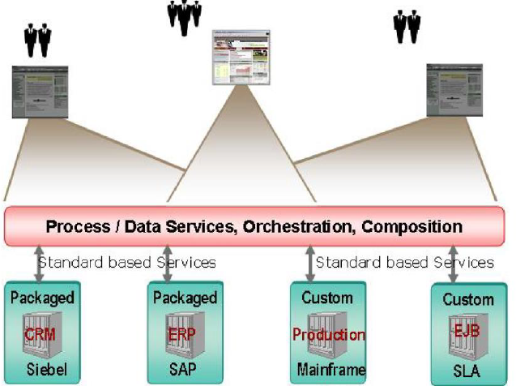

## Allg. Definition SOA
SOA = Paradigma für die Strukturierung und Nutzung verteilter Funktionalität, die von unterschiedlichen Benutzern verantwortet wird.
> SOA = Architekturmuster, welches den Aufbau einer Anwendungslandschaft aus einzelnen Anwendungen beschreibt.
> - Die Anwendungen sind lose gekoppelt, indem sie ihre Funktionalitäten durch Services anbieten.

# Web Services
- XML Standarts
    - Web-Services stellen eine Technologieplattform dar, mit deren Hilfe Servicearchitekturen realisiert werden können.
- Web Serives basieren auf Text ("Jede Programmiersprache kann Text")
    - Unabhängiger Aufbau durch Serialisierung/Deserialisierung von Textnachrichten

## Web Service Dreieck


> UDDI = Universal Description, Discovery, and Integration => Naming Service

## SOAP = Simple Opject API (SOAP)
SOPA-Spezifikation legt fest, wie Nachrichten aufgebaut sein müssen um als SOAP-Nachricht zu gelten.
SOAP = Kommunikationsprotokoll (textbasiert)

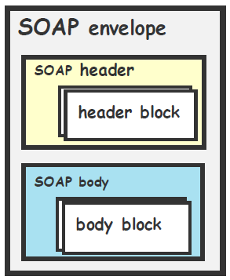

> Aufbau einer SOAP Nachricht

```xml
<s:envelope xmlns:S="http://schemas.xmlsoap.org/soap/envelope/">
    <s:body>
        <ns2:isCreditworthy xmlns:ns2="http://bank/">
            <arg0>Hans</arg0>
            <arg1>100.0</arg1>
        </ns2:isCreditworthy>
    </s:body>
</s:envelope>
```
> Beispiel einer SOAP Nachricht für einen Kreditdienst

## WSDL = Web Service Definition Language
XML-Vokabular zur Beschreibung von Schnittstellen

WSDL beschreibt:
- bereitgestellte Funktionen
- Datentypen der Nachrichten (Request und Response)
- Für Protokoll relevante Informationen
- Adressen unter denen Dienste erreichbar sind

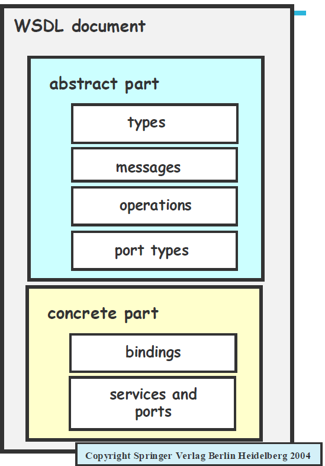 
<table>
<th>Element</th><th>Definition</th>
    <tr>
        <td>definitions</td>
        <td>Wurzelelement</td>
    </tr>
    <tr>
        <td>types</td>
        <td>Definiert Benutzerdefinierte Datentypen</td>
    </tr>
    <tr>
        <td>messages / operations</td>
        <td>Benennt Nachrichten</td>
    </tr>
    <tr>
        <td>portType</td>
        <td>Definiert Ein- und Ausgabenachrichten</td>
    </tr>
    <tr>
        <td>binding</td>
        <td>Beschreibt Details, wie Nachrichten über das Netzwerk übertragen werden</td>
    </tr>
    <tr>
        <td>service</td>
        <td>Beschreibt die Adressierung des Web Service</td>
    </tr>
</table>


## Arten des Nachrichtenaustauschs

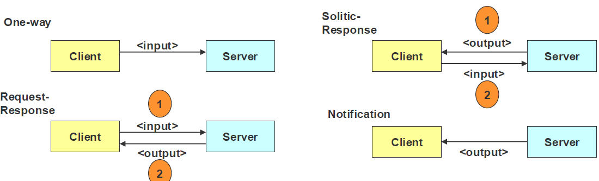

- One Way
    - Nur eine Input-Nachricht
- Request-Response
    - eine Input-, eine Output-, ggf. fault-Nachricht
- Solicit-Response
    - Operation hat Output- und Input-Nachricht => Aktion geht von Server aus!
- Notification
    - Notification von Server an Client
    - Hat nur eine Output-Nachricht


# Java Messaging System (JMS)

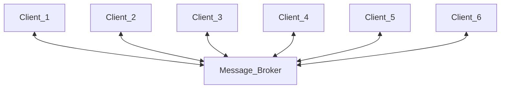
```mermaid
graph TD;
    Client_1 <--> Message_Broker;
    Client_2 <--> Message_Broker;
    Client_3 <--> Message_Broker;
    Client_4 <--> Message_Broker;
    Client_5 <--> Message_Broker;
    Client_6 <--> Message_Broker;
```
>Eine, Anwendung, die auf einem Messaging System beruht, wird oft als loses gekoppeltes System bezeichnet.

Messaging System wird dazu verwendet, dass mehrere Anwendungen Informationen als Nachrichten austauschen.
- Nachricht = Paket aus Daten und Routing Informationen
- Nachrichtenversand über MOM
>Nachricht an Message Broker = Synchron
>Asynchron durch zeitliche Entkoppelung
>>Kommunikation zwischen Teilelementen = Asynchron


## MOM = Message Orientated Middleware

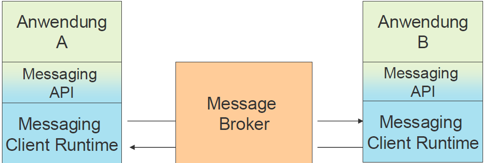

### Messaging Modelle


#### Publish Subscribe (Pub/Sub)(1 -> Viele)
Vergleichbar mit Newsletter 
- Einer oder mehrere Publisher(Quellen) senden Messages an ein Topic
- MOM leitet Messages an alle Subscriber(Empfänger) weiter
    - Information wird an alle, welche das Topic aboniert haben ausgeliefert
    - Subscriber registrieren sich bei MOM für Topics

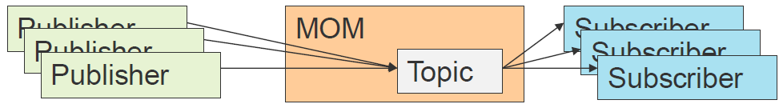

#### Point to Point (P2P) (1->1)

- Ein oder Mehrere Sender stellen Messages in eine Queue
    - Nachricht kann von einem Receiver abgeholt werden (aus Queue rausnehmen)
    - Alternativ liefert MOM Nachricht an einen Empfänger aus
- **Eine Message wird an genau einen Empfänger ausgeliefert**
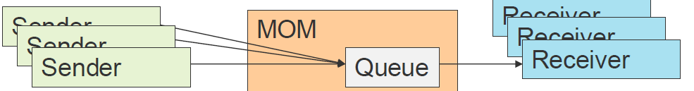

>Gut skallierbar, da beliebig Receiver hinzugefügt/entfernt werden können.

1. Erzeugung einer Connection
2. Auf Connection wird eine oder mehrere Sessions erzeugt
3. Auf Session werden eine oder mehrere Sender/Receiver erzeugt
4. Registrierung and Queue (Nachrichten empfangen/ausliefern)

Asynchrones Lesen per Observer 
- Registrierung von Listenern (onMessage)
    - Beim Aufruf wird ein neuer Thread gestartet (dadurch asynchron)

## Broker Varianten

- Internal Broker = Der Message Broker ist direkt innerhalb der Anwendung oder des Application Servers integriert
- External Broker = Der Message Broker wird als eigenständiger externer Service betrieben. Anwendungen verbinden sich über das Netzwerk mit diesem Broker.
- Embedded Broker = Der Broker ist in die Anwendung selbst eingebettet, d. h., er läuft im selben Prozess wie die Anwendung.

## Zusammenspiel der Komponenten (Client, JNDI, Messagebroker und Messageserver)

1. Client schaut wo liegt das Messaging service (lookup) => Referenz auf JMS-Client Runtime
2. Erzeuge Connection
3. Erzeuge Session (Auf einer Connection können mehrere Sessions liegen)
    - Senden/Empfangen kann unterschiedliche Quality of Service unterstützen. Diese QOS werden an der Session festgelegt.
    - Je höher QOS ist desto aufwendiger diese Nachrichten zu senden
4. Lookup Topic/Queue => Womit möchte ich kommunizieren
    - Man kann auch dynamisch Topics/Queues erzeugen
5. Erzeuge Publisher/Subscriber (Sender/Receiver)
    - Topic Publisher/Subscriber
    - Queue Sender/Receiver
6. Message Handling

## Kontaktaufbahme zu MOM

1. MOM-System registriert einen Naming-Service
    - sogenannte Connection-ListFactory
    - (optional) eingerichtete Queues
2. Über Connection-Factory wird Connection zu MOM-System erzeugt
3. Von MOM-System wird eine Session angefordert
    - Bei Session wird **QOS** spezifiziert

### Quality of Service (QOS)
- AUTO_ACKNOWLEDGE
- DUPS_OK_ACKNOWLEDGE
- CLIENT_ACKLOWLEDGE

## Message Typen
<table>
<tr>
<th>Text</th>
<td>Test <br/> Playload = String</td>
</tr>
<tr>
<th>Object</th>
<td>Objekte welche serialisiert/deserialisiert werden. <br/>Klassendefinition muss bei Sender und Empfänger definiert sein.</td>
</tr>
<tr>
<th>Byte</th>
<td>primitive Datentypen(nummerisch)</td>
</tr>
<tr>
<th>Stream(Streaming)</th>
<td>Sequenz von primitiven Typen => StreamMessage respektiert die Einfügungsreihenfolge</td>
</tr>
<tr>
<th>Map</th>
<td>Name/Value-Paare-Paare</td>
</tr>

</table>

### Aufbau einer Message
Message besteht aus drei Teilen (Header, Properties und Payload)

Header = wird automatisch von MOM gesetzt (Destination, DeliveryMode, Message ID, Priority ...)
Properties = Benutzerdefinierte Properties
Payload = Inhalt (Text, Byte, Object, etc.)


## Features
### Selektoren
Selektoren "Filtern" die Nachrichten auf bestimmte eigenschaften => Vorsortierung anhand der Properties => Client empfängt nur Nachrichten "wie er möchte"

### Temporäre Queue
Zwischen Sender und Empfänger kann jederzeit ein "privater" Kanal eingerichtet werden, welcher nicht im JNDI sichtbar ist.
Die temporäre Queue wird mit in Session gegeben.
=> Dadurch ist asynchrones Request/Response möglich

### Weitere
Nachrichten können transient (default) oder persistent(Nachricht wird gehalten bis Empfänger da ist) sein
- Meistens mit Gültigkeitsdatum um nicht ewig zu halten

Nachrichtenversand und -empfang kann in Transaktionen eingebettet werden.
Topics können als dauerhaft gekennzeichnet werden => dasselbe wie persistente Nachrichten.

## Anwendungsfälle
<table>
<tr>
<th>Nachrichtenaustausch</th>
<td>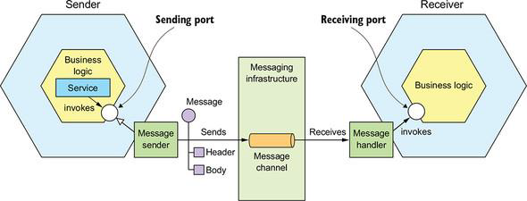</td>
<td>Fire-and-Forget</td>
</tr>
<tr>
<th>Request/ Async-Response-Pattern</th>
<td>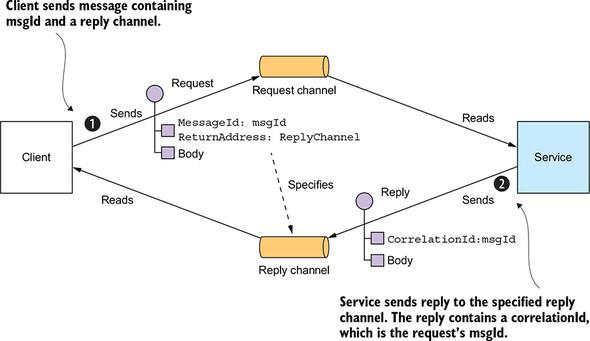</td>
<td>Response ist Asynchron</td>
</tr>
<tr>
<th>Messaging-Based Service API</th>
<td>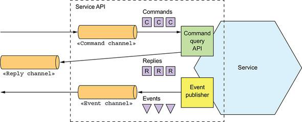</td>
<td>Event-Channel ist eine „One-Way“-Benachrichtigung an alle interessierten Services.</td>
</tr>
</table>

## Vergleich Synchron vs. asynchron

<table>
<tr>
<th>Synchron</th>
<td>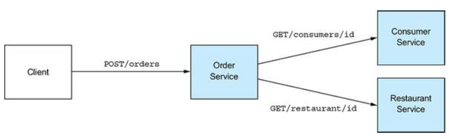</td>
</tr>
<tr>
<th>Asynchron</th>
<td>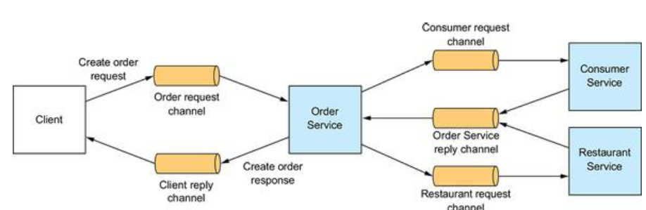</td>
</tr>
</table>

Bei Synchroner API ist Client blockiert, bis die Bestellung/Anfrage abgearbeitet ist.
- Hat jeder Service eine Verfügbarkeit von 99,5% ist die Gesamtverfügbarkeit (99,5%)<sup>3</sup>= 98,5%
- Bei 1 Services (99,5)<sup>10</sup>=95,1%
- usw.


# Verteilte Transaktionen

Verteilte Transaktionen sind Transaktionen, welche über mehrere transaktionale Systeme involviert sind.

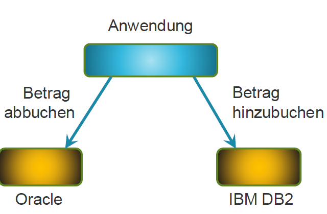

## ACID

- A–Atomar
    - Eine Transaktion wird komplette oder gar nicht ausgeführt (commit oder abort)
- C–Konsistent
    - Eine Transaktion überführt einen konsistenten Zustand in einer anderen konsistenten Zustand.
    - Wird durch Transaktionsdesign realisiert
- I–Isoliert
    - Eine Transaktion läuft isoliert, wenn sie den selben Effekt hat, egal ob sie parallel mit anderen Transaktionen oder alleine abläuft.
    - Wenn ich eine isolierte Umbuchung mache ist das Ergebnis erst nach Ende der Transaktion sichtbar
    - Isolierungsstufen / Isolierungsgrade
        - READ COMMITTED
        - REPEATABLE READ
        - SERIALIZABLE
- D–Dauerhaft
    - Die Änderungen einer Transaktion sind nach der Transaktion dauerhaft gespeichert.
    - Die dauerhafte Speicherung der Daten muss auch nach einem Systemfehler garantiert sein.

ACID kann nur von relationalen Datenbanken garantiert werden. NoSQL-Datenbanken garantieren nicht alle ACID-Funktionalitäten. NoSQL nutzt häufig BASE.

## Transaktionsmanager


### Ablauf


<table>
<tr>
<td>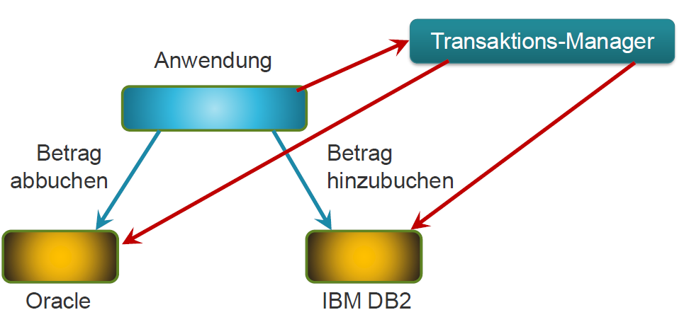</td>
<td>Diese verteilte Transaktion muss von außen gesteuert werden<br>Die beteiligten Systeme, müssen dafür ihre Autonomie über das Transaktionsverfahren aufgeben!</td>
</tr>
<tr>
<td>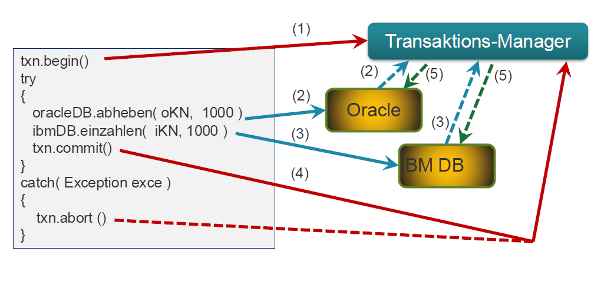</td>
<td>
1.      Anwendung eröffnet Transaktion => Erhält Transaktions-ID<br>
2-3.    Beteiligte Ressourcen registrieren sich bei Transaktionsmanager unter der Transaktions-ID<br>
4.      Anwendung beendet (commit oder abort) die Transaktion mit Transaktions-ID<br>
5.      Transaktionsmanager führt Commit-Protokoll mit den an Transaktions beteiligten Ressourcen durch.
</td></tr></table>

## 2-Phasen Commit Protokoll

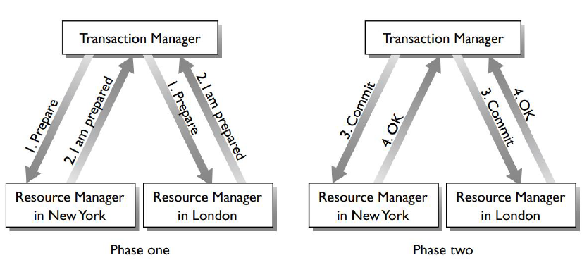

Phasen:

1. Prepare Phase: Alle werden befragt ob sie den Commit machen können
- Uncertain Phase (Wenn hier was schief läuft ist die Bestätigung da aber die Transaktion nicht durch)
    - Wenn hier was schief läuft "stehen" alle Beteiligten
2. Commit Phase: Er sagt okay vollzieht den Commit oder alle zurückrollen

## X/Open-Transaktionsmodell


- Das Anwendungsprogramm initiiert Transaktionen über das TX Interface.
- Der Transaktionsmanager koordiniert alle Transaktionen und stellt sicher, dass sie korrekt abgeschlossen werden.
- Die Resource Manager führen die eigentlichen Operationen (Lesen, Schreiben) aus und werden über das XA Interface in die Transaktion eingebunden.
## BASE

- BA = Basically Available 
    - Stellt garantiert allen Benutzern Abfragen zur Verfügung => Keine Konsistenz garantiert
- S = Soft State 
    - States können sich über äußere Einflüsse andern
- E = Eventually Consistent 
    - Nicht eventuell sondern Irgendwann Konsistent
    - Zustand des Systems wird schrittweise über alle Knoten repliziert.
        - System wird nach und nach konsistent

Beispiel der Microservice Architektur => Nicht mit 2-Phasen-Transaktion umsetzbar => Funktioniert einfach nicht

## SAGA - Transaktionsmodell

Keine Abkürzung => Geschichte Sage
Sequenz von Transaktionen, welche Dinge aktualisieren 
Jede Änderungsoperation die ich habe muss eine Rückgängigkeitsmöglichkeit haben
"Ich muss mich selbst darum kümmern, dass die Dinge rückgängig machbar sind"
>=> Aufteilung einer verteilten Transaktion in lokale Transaktionen.


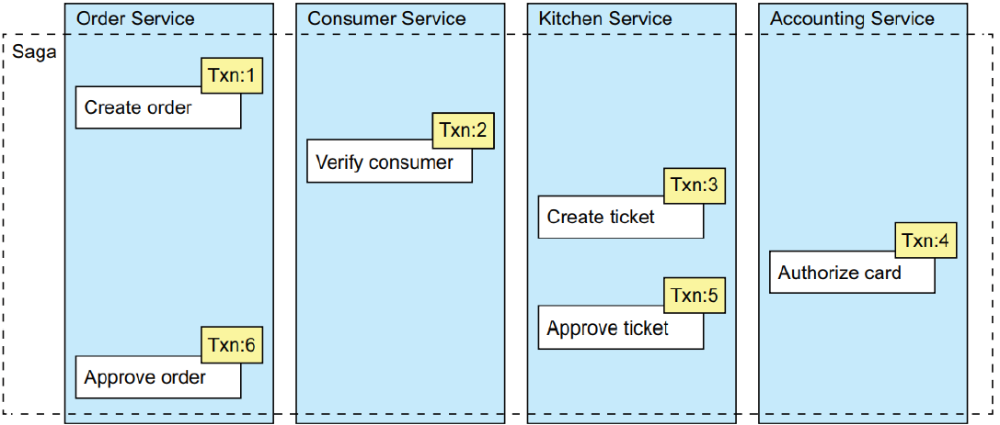

> Die Gesamten kleinen Transaktionen sind die Saga. Wenn etwas schief geht bei Schritt (5) müssen überall Kompensierende Transaktionen aufgerufen werden können, welche Schritt 1-4 rückgängig machen können.

### Pattern: Orchestrierung

Merkhilfe => Orchester mit Dirigent => Ohne Dirigent kann Orchester nicht spielen

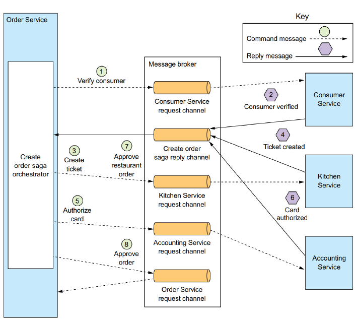

Hier nimmt der OrderService den Platz als Orchestrator/Dirigent ein. Über ihn laufen alle Prozessabläufe.

Nachteile:
- Sollte der Dirigent ausfallen kann das gesamte System nichtmehr korrekt arbeiten, da die Anweisungen fehlen
- Außerdem entsteht durch den Dirigent ein Flaschenhals, da der Dirigent alle Prozesse stattfinden abarbeiten muss, wodurch der Durchsatz ab einem gewissen Punkt sehr wahrscheinlich darunter leidet.

### Pattern: Choreographie

Merkhilfe => Balett => Jeder weiß was er zu tun hat und kuckt nur auf seine Nachbarn ob das klappt
Komponenten organisieren sich selbst

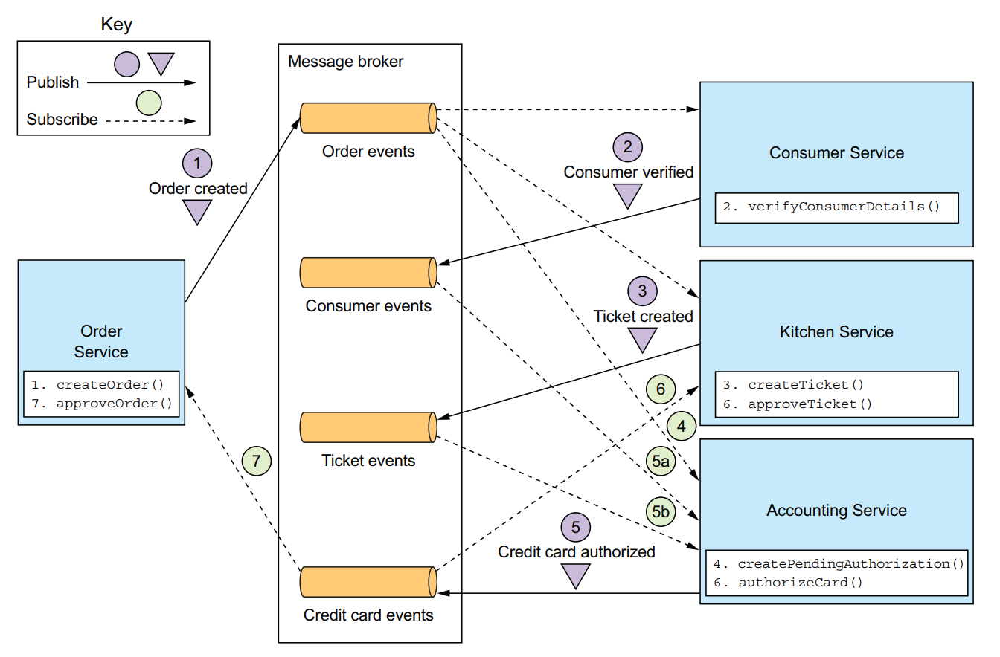

Jeder Service kommuniziert über bestimmte Events/Aufrufe und arbeitet nur eine Aufgabe ab ohne das große Ganze zu kennen.


## CAP-Theorem

**Sehr wichtig!!!**

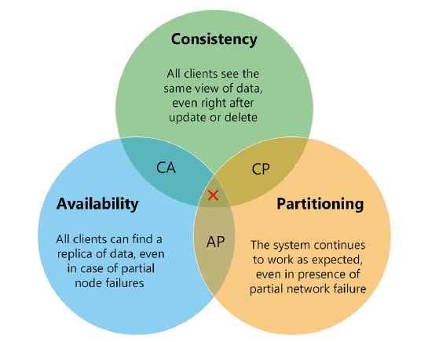

- C - Consistency (Konsistenz )
    - Alle Clients sehen zum gleichen Zeitpunkt die gleichen Daten
- A - Availability (Verfügbarkeit)
    - Alle Clients können jederzeit Lese- und Schreibzugriffe durchführen, da stets vom System beantwortet werden
- P - Partition Tolerance (Ausfalltoleranz)
    - Das System kann trotz des Ausfalls einzelner Knoten(bzw. wenn einzelne Knoten nicht mehr miteinander kommunizieren können), als Ganzes weiterarbeiten.
> **Man kann immer nur 2 Haben (CA, CP, AP)**

- CP – Anforderung
    - Wenn man Konsistenz und Toleranz gegenüber Ausfällen fordert, kann man keine Verfügbarkeit garantieren.
- CA – Anforderung
    - Wenn man Konsistenz und Verfügbarkeit garantieren möchte, darf es zu keinen (Teil-) Ausfällen kommen.
- AP – Anforderung
    - Wenn ein System verfügbar und tolerant gegenüber (Teil-) Ausfällen (des Netzwerks) sein soll, kann keine Konsistenz zugesichert werden


# REST (Representational State Transfer)


## Motivation für REST
Motivation = viele Programme innerhalb einer Firma
Benötigt wird ein "einheitliches" Kommunikationsprotokoll, welches von allen Anwendungen unerstützt wird.
=> Http
=> JSON / XML => Programmiersprachenunabhängig

## Rest als Beschreibungsformat
Rest ist keine Architektur, sondern ein Rahmen für einen Architekturstil!
> Häufig Client/Server Architektur auf Basis von HTTP als Trägerprotokoll
>> RESTful HTTP

**Rest schreibt kein Protokoll vor, wird aber i.d.R mit HTTP verwendet**

## Exkurs HTTP

HTTP ist ein einfaches Textbasiertes Client-Server-Protokoll

GET, POST, PUT, DELETE, etc. => HTTP Aufrufe

Rest kennt nur Ressourcenbegriff
Ressource ist alles auf das zugegriffen oder verändert werden kann

## Fünf Prinzipien von REST
1. Ressourcen besitzen eine eindeutige ID (adressable ressources)
    - Bei RESTful HTTP sind das URLs
2. Ressourcen können unterschiedliche Repräsentationen besitzen
    - Bei RESTful HTTP ist das oft JSON oder XML
3. Standartisierte Methoden
    - Bei RESTful HTTP sind das die HTTP-Methoden GET, POST, PUT, DELETE
4. Statuslose Kommunikation
    - HTTP ist zustandslos
5. Hypermediaverwendung
    - Hypermedia As The Engine Of Application State (HATEOAS)
    - Ressourcen können verknüpft werden über Links
    - Wird von den meisten REST-Anwendungen nicht verwendet

## Architekturprinzip: Adressierbarkeit

Adressierung über URI

=> Adressierung über HTTP
http://example.com/kunde?name=Harry&plz=66482

- ```http``` entspricht Protokoll
- Standart Port ist 80
- ```Kunde``` entspricht Ressource bzw. Prad zu Ressource
- ```name=Harry&plz=66482``` ist der Query-String


Da jeses Objekt eine URI besitzt, können Ressourcen verlinkt werden (JSON-FORMAT)
```{json}
{
    "name": "Luke Skywalker",
    "hair_color": "blond",
    "homeworld": "https://swapi.dev/api/planets/1/",
    "films": [
        "https://swapi.dev/api/films/2/",
        "https://swapi.dev/api/films/6/",
        "https://swapi.dev/api/films/3/",
        "https://swapi.dev/api/films/1/",
        "https://swapi.dev/api/films/7/"
    ]
}
```

## Repräsentationen

Ressource ist eine Abstraktion, von der bei Bedarf eine Repräsentation erzeugt wird
```{json}
{
    'name' : 'Albert'
    'id' : '42'
}
```
> Repräsentation einer Person durch ID und Name

### Repräsentationsanforderung
Clients können über URLs Ressourcen identifizieren und übebr HTTP-Methoden abrufen
Clients geben in der Regel die Repräsentationsform an, die sie erwarten
```
GET products/143 HTTP/1.1
Host: www.example.com
Accept: application/xml, application/json => Repräsentationsform, welche akzeptiert wird
```

## Standartisierte Methoden

**GET, PUT, DELETE sind idempotent**
**Nur POST ist nicht idempotent**

Idempotent => Hat einmal eine Wirkung, beim zweiten mal jedoch keine
> Beispiel |-3| = 3 => ||-3|| = 3 => Der zweite Betrag hat keine Wirkung

Als Daumenregel gilt für CRUD(Create, Read, Update, Delete)
<table>
    <th>Aktion auf der Ressource</th>
    <th>HTTP-Methode</th>
    <th>RPC-Style Schnittstelle</th>
    <td>RESTful HTTP</th>
    <tr>
        <td>CREATE</td>
        <td>POST</td>
        <td>addBook()</td>
        <td>POST /books</td>
    </tr>
    <tr>
        <td>READ</td>
        <td>GET</td>
        <td>getBooks()</td>
        <td>GET /books</td>
    </tr>
    <tr>
        <td></td>
        <td></td>
        <td>getAuthorsFromBook()</td>
        <td>GET /books/{id}/authors</td>
    </tr>
    <tr>
        <td>UPDATE</td>
        <td>PUT bzw. PATCh</td>
        <td>updateBook()</td>
        <td>PUT /books/{id}</td>
    </tr>
    <tr>
        <td>DELETE</td>
        <td>DELETE</td>
        <td>deleteBook()</td>
        <td>DELETE /books/id{id}</td>
    </tr>
</table>


## Statuscodes
Der Server kann durch HTTP-Statuscodes Informationen an den Client zurückgeben

|Statuscode | Wirkungsbereich |
|:---:|---|
|1xx    |   dient Informationszwecken und signalisiert, dass die Bearbeitung noch nicht abgeschlossen ist|
|2xx    |   signalisiert, dass die Bearbeitung erfolgreich abgeschlossen wurde
|3xx    |   Zeigt Umleitungen an
|4xx    |   wird für Client-seitige Fehler benutzt
|5xx    |   signalisieren Fehler, die bei der Bearbeitung der Anfrage auf dem Server aufgetreten sind.

### Wichtige Statuscodes

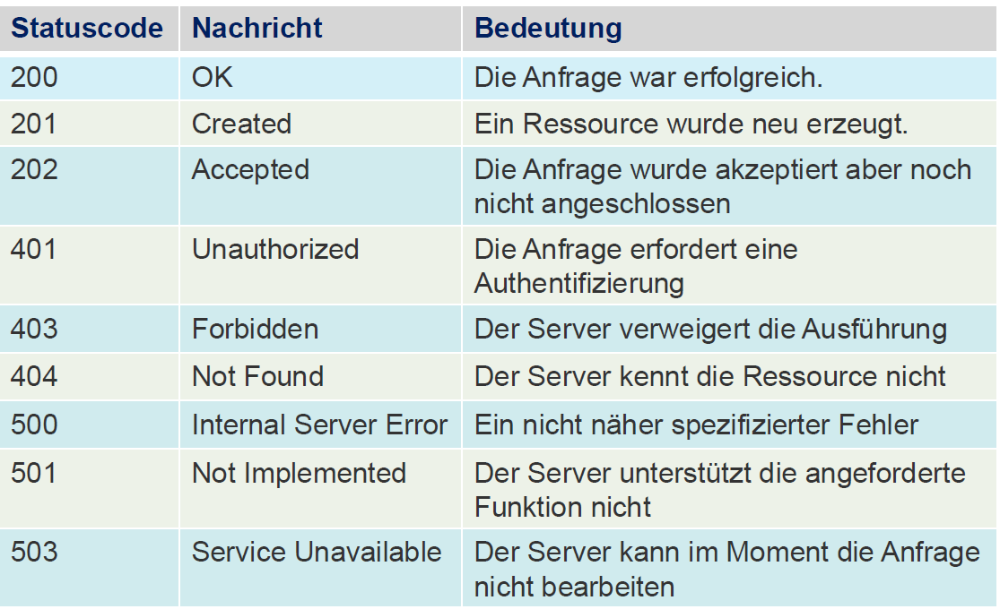


## Richardson Maturity Model
Kathegorieren klassifizieren RESTful-Anwendungen nach Reifegrad

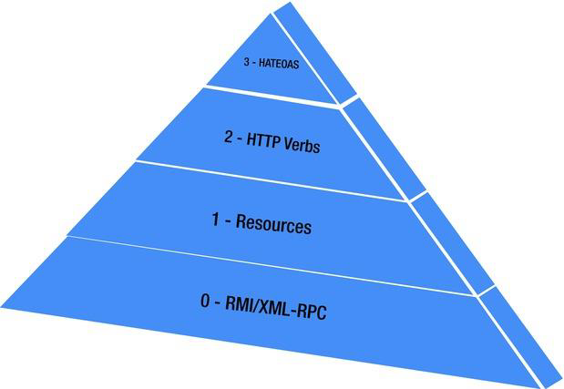

- Level 0
    - Http als Transportprotokoll

- Level 1
    - Ressourcen-Begriff wird verwendet => Ressourcen über eindeutige URLs angesprochen
    
- Level 2
    - HTTP-Befehle werden für CRUD verwendet
- Level 3
    - HATEOAS => Ressourcen sind über Links verbunden und "selbstbeschreibend"

## Hypermedia 
Hypermedia = Hypertext + Multimedia
Links zur Verknüpfung verschiedener Medien


## REST als Architekturstil

- Definiert die Anwendung als ein System verteilter Ressourcen, welche über Links miteinander verbunden sind.
- Im Zentrum einer REST-API stehen die Ressourcen, welche über URLs identifizierbar(über Links erreichbar) sind.
- Um Ressource zu verändern muss Repräsentation der Ressource verändert an diese geschickt werden.

## Best Practices 
1. Nomen für Ressourcen im Plural
    - ``` /vehicles => Fahrzeuge ```
    - ```/vehicles/12 => Fahrzeug nummer 12 ```
2. Keine Verben in URLs
    - ``` /getColor ``` Schlecht
    - ``` /color ``` Gut
3. Kein / am Ende
    - ``` /vehicles/data/power/ ``` Schlecht
    - ``` /vehicles/data/power ```Gut
4. Vorsicht bei Verwendung von Trennzeichen
    - ``` /testAPI/dasIstNixGut ``` Schlecht
    - ``` /testAPI/das_ist_nix_gut ``` Schlecht
    - ``` /testAPI/das-ist-okay ``` Gut


# Microservices

Vorteile: Skalierbarkeit, Geschwindigkeit, Kopplung, etc.

Nachteile: Automatisches Build- und Deployment notwendig, Komplexe Infrastruktur und Runntime (Cloud) notwendig

## Typisches Implementierungsszenario für Produkt am Beispiel Monolith

Benutzung CI-Pipeline

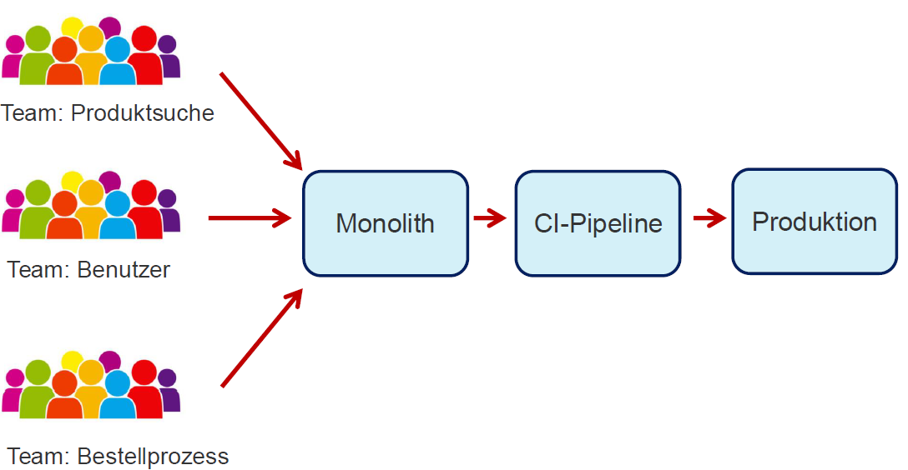

## Conways Law

*Any organization that designs a system (defined more broadly here than just information systems) will inevitably produce a design whose structure is a copy of the organization’s communication structure.* - Melvin Conway: “How Do Committees Invent?,” Datamation, April 1968

> In Simpel: Die Struktur einer Organisation spiegelt sich in den Systemen wider, die sie entwickelt.
>> Wie ein Team organisiert ist und miteinander kommuniziert, beeinflusst direkt, wie die von diesem Team entwickelten Produkte und Systeme aussehen.

## Teamrollen in Microservices 

|Klassisch |Microservices|
|-----|-----|
| 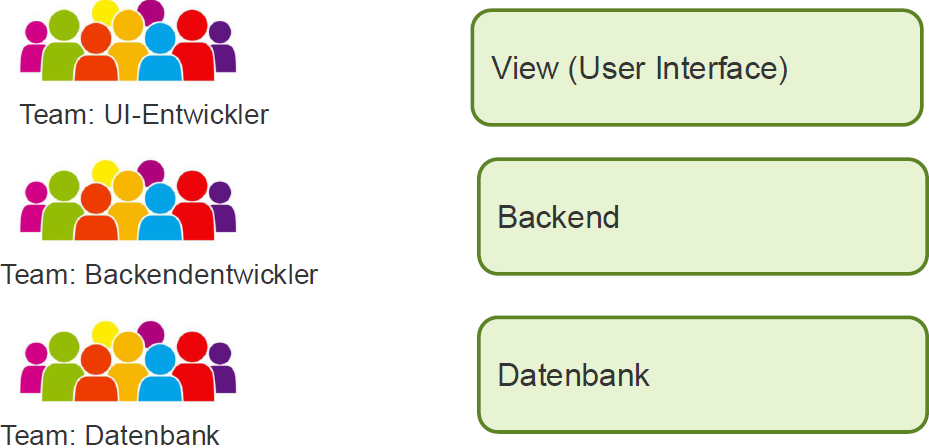 | 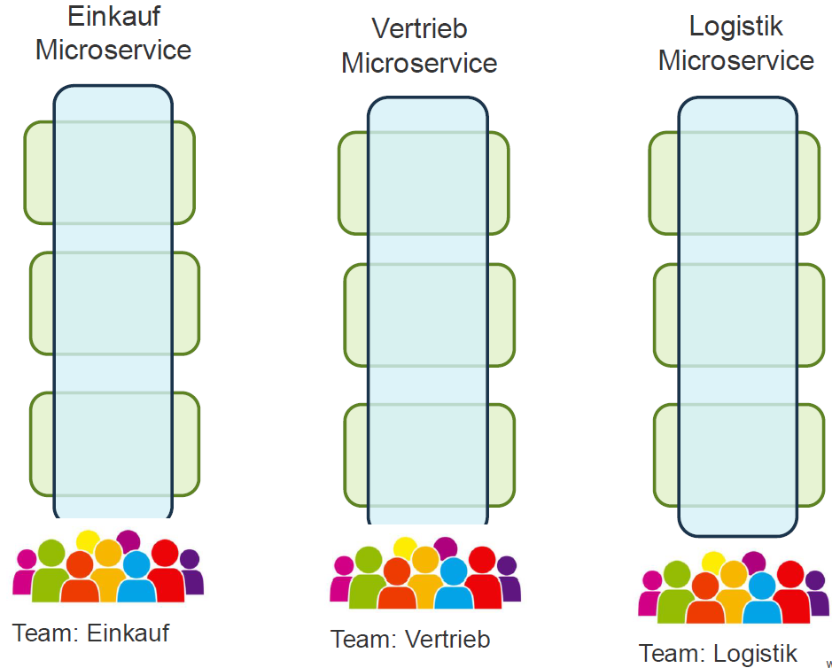


## Definition Microservices
Architekturstil bei der Anwendung in kleine Teile aufgeteilt wird, die unabhängig voneinander entwickelt werden und installiert werden

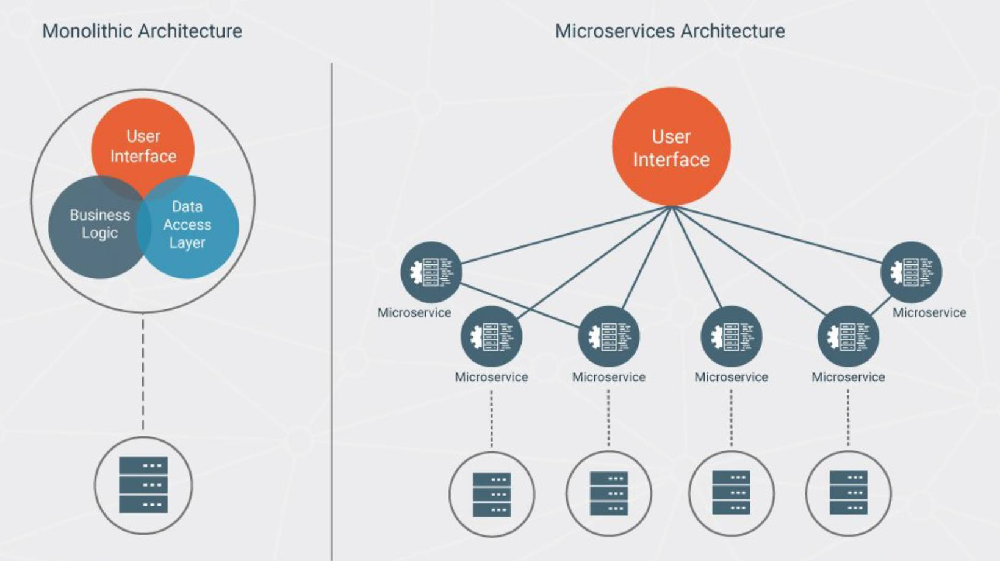

## Technische Kommunikation 

Ein Microservice stellt seine Funktionalität über eine REST-API und/oder ein Topic zur Verfügung.

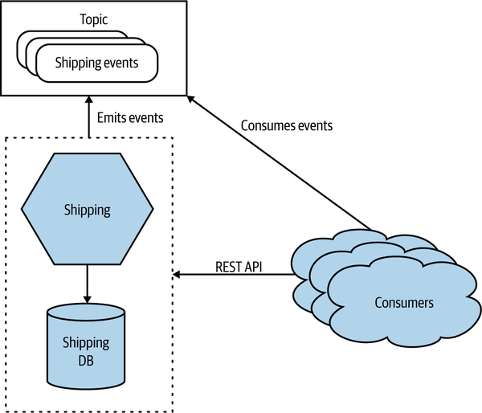

## Skalierungsmöglichkeiten

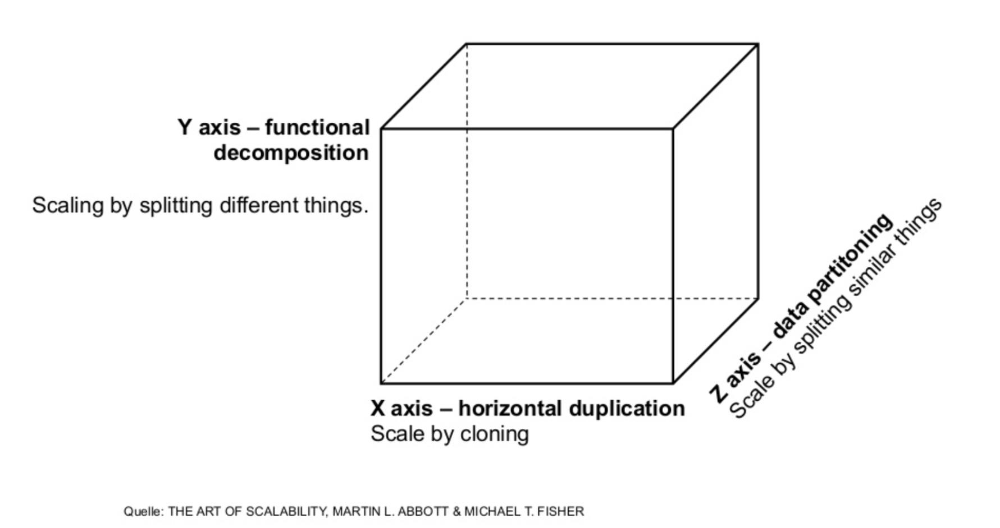

Daraus resultiert CAP-Theorem 

## The Twelve Factors

Definiert Best Practices für Anwendungen
|Nr|Beschreibung|Definition|
|-----|-----|-----|
|1  |   Codebase                    |   Eine im Versionsmanagementsystem verwaltete Codebase, viele Deployments
|2  |   Abhängigkeiten              |   Abhängigkeiten explizit deklarieren und isolieren
|3  |   Konfiguration               |   Die Konfiguration in Umgebungsvariablen ablegen
|4  |   Unterstützende Dienste      |   Unterstützende Dienste als angehängte Ressourcen behandeln
|5  |   Build, release, run         |   Build- und Run-Phase strikt trennen
|6  |   Prozesse                    |   Die App als einen oder mehrere Prozesse ausführen
|7  |   Bindung an Ports            |   Dienste durch das Binden von Ports exportieren
|8  |   Nebenläufigkeit             |   Mit dem Prozess-Modell skalieren
|9  |   Einweggebrauch              |   Robuster mit schnellem Start und problemlosen Stopp
|10 |   Dev-Prod-Vergleichbarkeit   |   Entwicklung, Staging und Produktion so ähnlich wie möglich halten
|11 |   Logs                        |   Logs als Strom von Ereignissen behandeln
|12 |   Admin-Prozesse              |   Admin/Management-Aufgaben als einmalige Vorgänge behandeln

=> Wichtig für Cloud Anwendungen
=> Je mehr erfüllt sind desto solider die Anwendung

## Evolution 

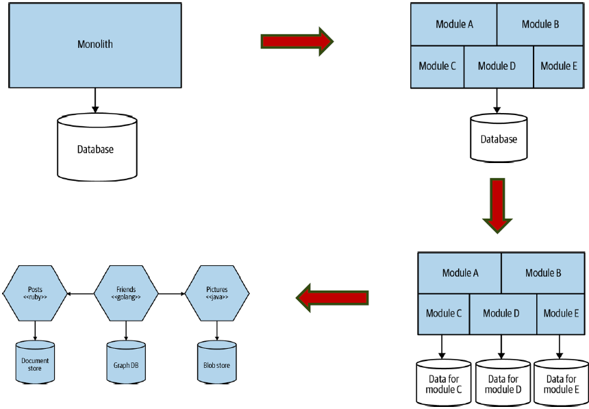

1. Matschball wird in Module unterteilt
2. Trennung von Daten
3. Module udn DBs werden geschnitten 

## Definition Microservice

Das Konzept der Microservices basiert auf der Idee, Anwendungen in kleinere, unabhängig voneinander arbeitende Dienste aufzuteilen. Dies ermöglicht flexibleres Entwickeln und Bereitstellen von Anwendungen, stellt jedoch keine universelle Lösung dar.

### Vorteile

▪ Ermöglicht die kontinuierliche Bereitstellung und den Einsatz großer, komplexer Anwendungen.
▪ Dienste sind klein und leicht zu warten.
▪ Dienste können unabhängig voneinander bereitgestellt werden.
▪ Dienste sind unabhängig skalierbar.
▪ Ermöglicht es Teams, autonom zu arbeiten.
▪ Ermöglicht ein einfaches Experimentieren und die Übernahme neuer Technologien.
▪ Bietet eine bessere Fehlerisolierung.

### Nachteile

▪ Es ist eine Herausforderung, die richtigen Dienste zu finden.
▪ Verteilte Systeme sind komplex, was die Entwicklung, das Testen und die Bereitstellung erschwert.
▪ Die Bereitstellung von Funktionen, die mehrere Dienste umfassen, erfordert eine sorgfältige Koordination.
▪ Die Entscheidung, ob und wann die Microservice-Architektur eingeführt werden soll, ist schwierig.


## Service als hexagonale Architektur

Man nutzt REST für Benutzer und Queues für die Services untereinander
Bsp. MQTT , ActiveMQ oder Kafka

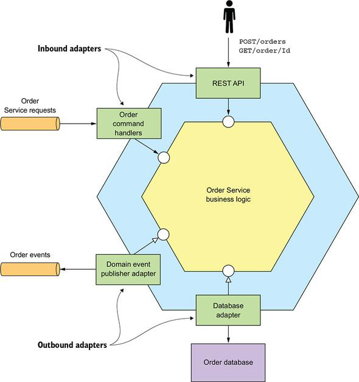

Besteht aus Business-Logik, einem oder mehreren Adaptern, welche Schnittstellungen zu externen Anwendungen und anderen Diensten bilden.

## API-Gateway

Ein API-Gateway beschreibt eine Verteilerschnittstelle / Zentrale Schnittstelle, welche auf die anderen Schnittstellen zugreift.

Ein API-Gateway kann eine mehrschichtige modulare Architektur besitzen. Die gemeinsame Schicht implementiert Funktionen, die allen APIs gemeinsam sind, z.B. Authentifizierung

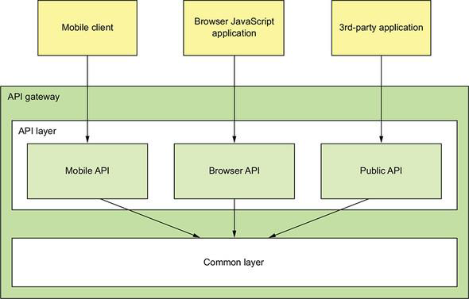

### Single Entry Point Gateway-API

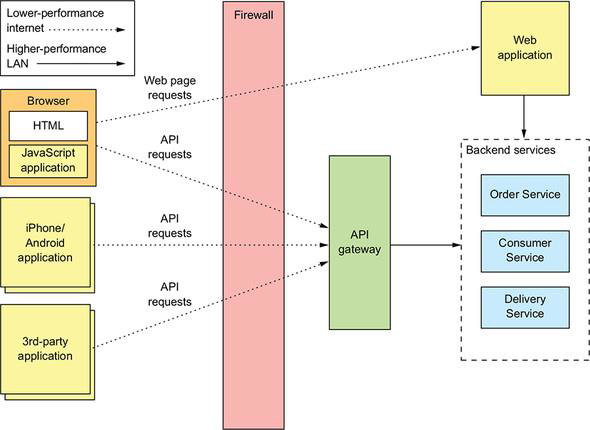


# Domain Driven Design (DDD)


Domain Driven Design beschreibt eine Vorgehensweise zur Modellierung komplexer Software im Großen und im Kleinen. Das Ziel hierbeit ist es Softwarelösungen im Einklang mit den Fachdomänen zu entwickeln. Ein Hauptmerkmal ist die Verwendung einer einheitlichen Sprache (ubiquitous language), welche von Fachexperten genutzt wird, durch welche Später die Bounded Contexts erstellt werden können.
> Software ist in einer Anwendungsdomäne verankert d.h. Im Kontext einer Bankanwendung geht es bsp. fachlich um Geld, Kredite oder Aktien.


> Jede Abteilung hat eigene Sicht auf die Komponenten und Akteure der Software. => Eigene Fachsprache

**Im Zentrum steht der Bounded Context**


## Ablauf Softwareentwicklung

*"There is no sense in talking about the solution before we agree on the problem,
and no sense talking about the implementation steps before we agree on the
solution."* - Efrat Goldratt-Ashlag

> In verständlich: Erst wenn die Anforderungen genau definiert sind lohnt es sicht ein Fachmodell zu entwickeln und erst dann sollte die Zielarchitektur geplant werden.

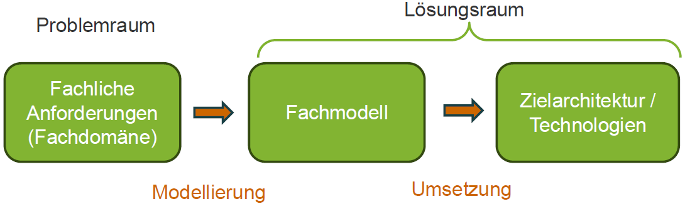


## Arten von Komplexität

1. Essentielle Komplexität
    - Innenwohnende Komplexität der Fachdomäne => Software für eine komplexe Domäne ist zwangsläufig komplex
    - Software für ein komplexes Bankensystem wird unwahrscheinlich simpel ausfallen
2. Akzidentelle Komplexität
    - Ensteht zufällig durch:
        - Misverständnissen bei Analyse der Fachdomäne
        - Schlechtes Design / schlechte Architektur
        - Einsatz von unpassender oder veralteter Technologie
        - Sachen bauen, die nicht benötigt werden (Unnötige Fancy Lösungen etc.)


|Arten von Komplexität|Entscheidungs- / Einflussbereiche|
|-----|-----|
| 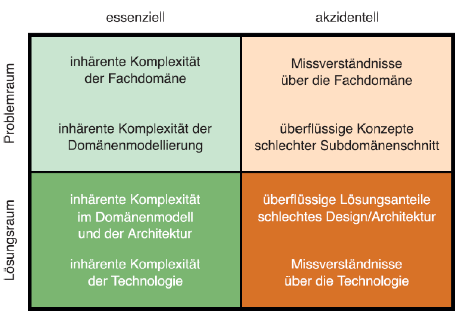| 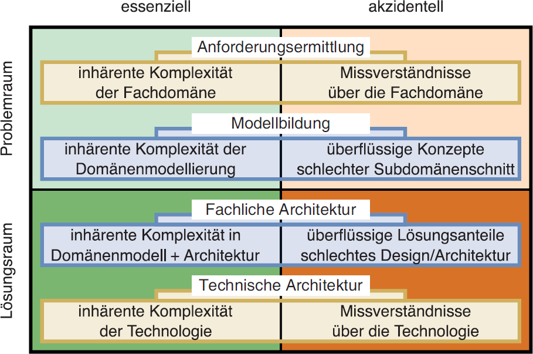 |


## Strategisches Design
Strategisches Design = Definiert die Bounded Contexte und Kommunikation zwischen diesen
> Beschäftigt sich mit dem Großen ganzen (Kontext Mapping , Zusammenarbeit zwischen Teams)

Aufteilung der Fachdomäne in einzelne disjunkte Bounded Contexts

Jeder Context nutzt eigene, der Anwendung entlehnte Sprache (**Ubiquitous Language**)
Die Begriffe dieser Sprache sollten sowohl im Gespräch als auch in den Klassendiagrammen als auch im Sourcecode auftauchen.

### Bounded Context
Der Bounded Context führt einen "geschützten" Raum ein mit einem vollständigen Fach- bzw. Prozessmodell und einer in dem Bereich "gesprochenen" (benutzten) Sprache.
=> Bounded Context repräsentiert abgeschlossenes vollständiges System


Architekturmodell für einen Bounded Context


- Architekturkonzepte = Technologische Lösungskonzepte wie bsp. Software-Architekturen

### Context Mapping

Teil des Strategischen Designs bei dem die Beziehungen der zuvor definierten Bounded Contexts definiert werden.

>Context Mapping = definiert Beziehungen und Datenaustausch zwischen den Bounded Contexts
>Faustregel: Ein fachlicher Kontext soll nur zu einem Team gehören, ein Team kann aber mehrere Kontexte besitzen.

Beim Context-Mapping steht Form der Zusammenarbeit zwischen den Teams im Vordergrund:
| Form der Zusammenarbeit |Bild|Beschreibung |
|---|---|---|
|Partnership| 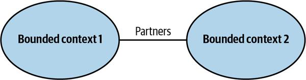 |Beide Teams sind voneinander Abhngig und können nur gemeinsam zum Ziel kommen. <br/> Verwenden i.d.R. CI
|Shared Kernel | 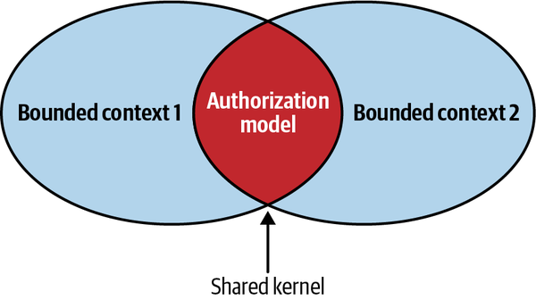|Beteiligte Teams teilen sich einen Teil des Modells | 
|Customer-Supplier |  | Ein Team (Customer) ist direkt von einem anderen Team (Supplier) abhängig <br/>Supplier kann auf Bedürfnisse des Customer eingehen<br/> Supplier bestimmt letzendlich was Cusomer erhält (Up-Down-Stream-Verhältnis)
|Conformist| 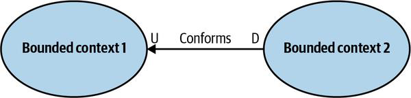 | Spezialfall des Customer-Supplier-Mappings <br/>Customer hat keine Möglichkeit auf Supplier einzuwirken => Übernimmt Module 1zu1
|Anticorruption Layer| 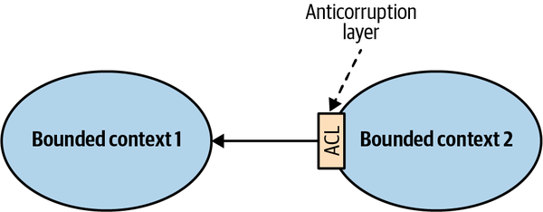 | Defensive Mapping-Art <br/>Downstream-Team baut "Übersetzungsschicht"(Adapter) um Sprache von Upstreamteam in eigene zu übersetzen
|Open Host Service| 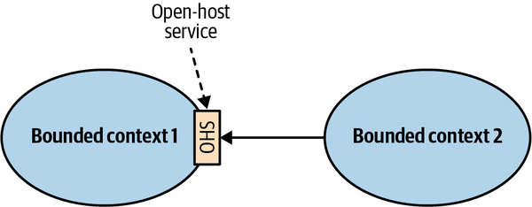 | Customer-Supplier-Mappings <br/>Upstream-Team stellt Schnittstelle(API) bereit, über die Informationen abgerufen werden können <br/> In der heutigen Zeit: OHS = API
|Published Language| 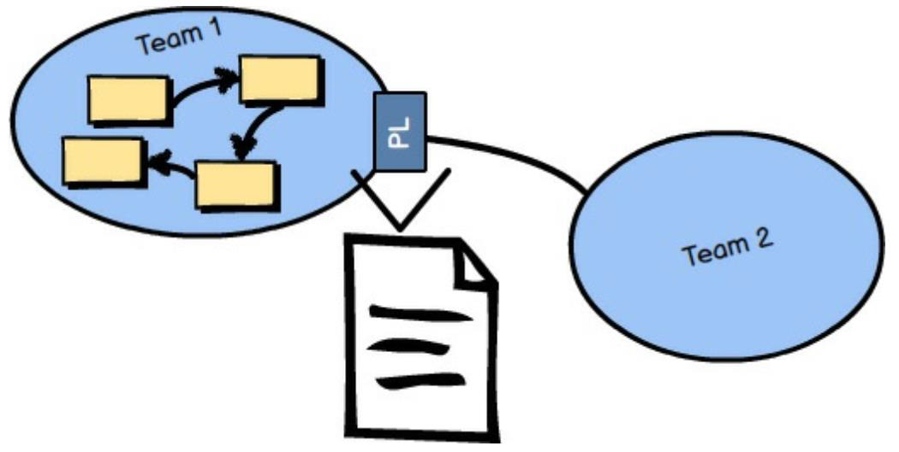 | Spezialisierung OHS <br/> Upstream-Team stellt Schnittstelle zum definierten Dokumentaustausch bereit.
|Seperate Ways|  | Jedes Team entwickelt eigene Funktionalität => Häufig nicht rentabel, da viel Code doppelt gebaut werden muss

## Taktisches Design

Das taktische Design beschäftigt sich damit das Innere der Bounded Contexts zu definieren.
Taktisches Design = Wie sieht so ein Bounded Context aus
> Beschäftigt sich mit der Modellierung innerhalb eines Bounded Contexts
=> Entwurf und Aufbau eines Bounded Contexts
- Zentrales Konstrukt: Aggregates
    - Bestandteile: Entities, Value Objects 
- Außerdem
    - Services, Repositories (DBs), Factories

### Aggregats

Ein Agregate besteht aus einem oder mehreren Entities und kann auch Value Objects enthalten
- Entity = Sache, welcher eindeutige ID zugewiesen ist
    - Kann geändert werden
- Value Object = Wert der nicht veränderbar ist
    - Besitzt keine ID
    - Beschreibung einer Sache

Aggregates repräsentieren einen "Zusammenhang", besitzen somit auch Mutationsfunktionalität
- Anemic Aggregates (Bestehen nur aus getter/setter) sollen vermieden werden

Es gelten folgende vier Regeln für den Entwurf von Aggregaten
1. Schütze fachliche Invarianten innerhalb von Aggregat-Grenzen
    - Aufbau eines Aggregates muss aus den Geschäftsregeln abgeleitet sein
2. Aggregate sollten "klein" sein
    - Große Aggregate führen leicht zu Konflikten oder Inkonsistenten
3. Andere Aggregate sollten nur über IDs referenziert werden
    - Alle Aggregate referenzieren das zugehörige Produkt über dessen ID => keine direkten Referenzen!
    - Dadurch soll das unbeabsichtigte Ändern eines Produkts verhindert werden
4. Andere Aggregate werden unter Verwendung von Eventual Consistency geändert
    - **Erinnerung: Eventually Consistent heißt nicht Eventuell Konsistent sondern irgendwann Konsistent**
    - Andere Aggregate werden unter Verwendung von Eventually Consistency geändert

=> CQS-Designprinzip kann helfen

### Command Query Responsibility Segregation (CQS)
Aufteilung des Domänenmodells: Anderungen und Abfragen arbeiten auf zwei verschiedenen Repositorien(DBs)
Queries = Lesende Zugriffe
- Lesen nur aus der Datenbank
Commands = Schreibende Zugriffe
- Das Command löst ein Event aus, welches die Lesedatenbank (irgendwann) aktualisiert
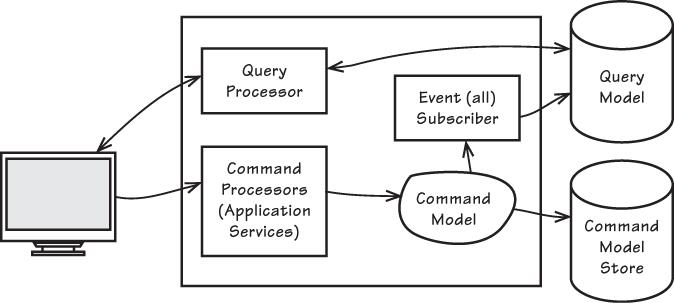

> Dies wird häufig beim Event Sourcing verwendet 

## Collaborative Modeling
 Collaborative Modeling = Anforderungsermittlung, identifiziert Geschäftsprozesse, Rollen und Arbeitsgegenstände im Problemraum
- z.B. Domain Story Telling

## Wichtige Begriffe 
Anticorruptionlayer = Adapter
Open-Host Service = REST-Schnittstelle
PL (Public Language) = JSON oder XML
RPC = Sowas wie RMI oder SOAP
Repository = Datenbank
Value Object = DTO => Datenhalter/Datenobjekte
Entity = Model
Abstraktion = Fachsprache

Invarianten = Schützen vor illegalen Zuständen
>Bsp. Artikel darf erst versendet werden wenn alle Bestellungen verarbeitet wurden => Doppelbuchungen vermeiden.

# Einführung Softwarearchitekturen

Softwarearchitektur hat keine allgemeine Definition

Softwarearchitekt sollte Projekt komplett begleiten

- Analyse von Geschäftsanforderungen
- Festlegung der architektonischen Merkmalen ("Fähigkeiten")
- Auswahl von Architekturmustern und -stilen
- Erstellung von Komponenten (die Bausteine des Systems)

|Architekt | Entwickler |
| --- | --- |
|Architekten sollten ein breites Wissen besitzen | Entwickler sollten ein tiefes Wissen Besitzen |


## Qualitätsattribute
Software-Bewertung nach Qualitätsattributen (*itility)

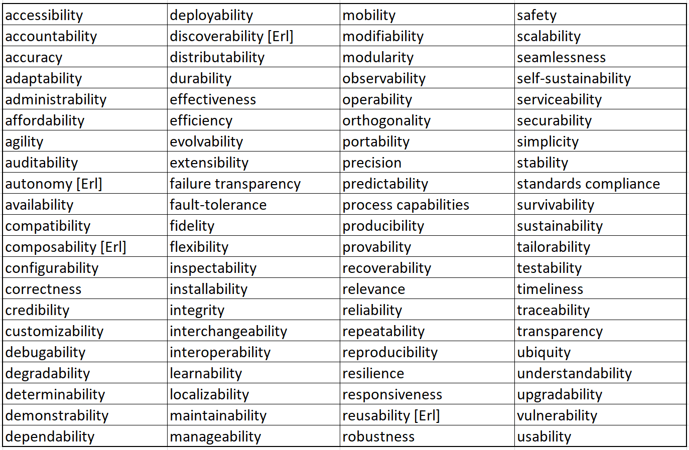


## Definition nach iSAQB
"*Softwarearchitektur definiert die grundlegenden Prinzipien und Regeln für die Organisation eines Systems, dessen Strukturierung in Bausteinen und Schnittstellen sowie deren Beziehungen zueinander wie auch zur Umgebung.*"

Dadurch Richtlinien für den gesamten Systemlebenszyklus.

## Baustein / Software Modul / Software Komponente 
Baustein bietet Schnittstellen an, die er im Sinne eines Vertrages garantiert.

Garantie gilt erst, wenn die benötigten Schnittstellen im Rahmen einer Konfiguration zur Verfügung gestellt werden(Export- und Import-Schnittstellen).

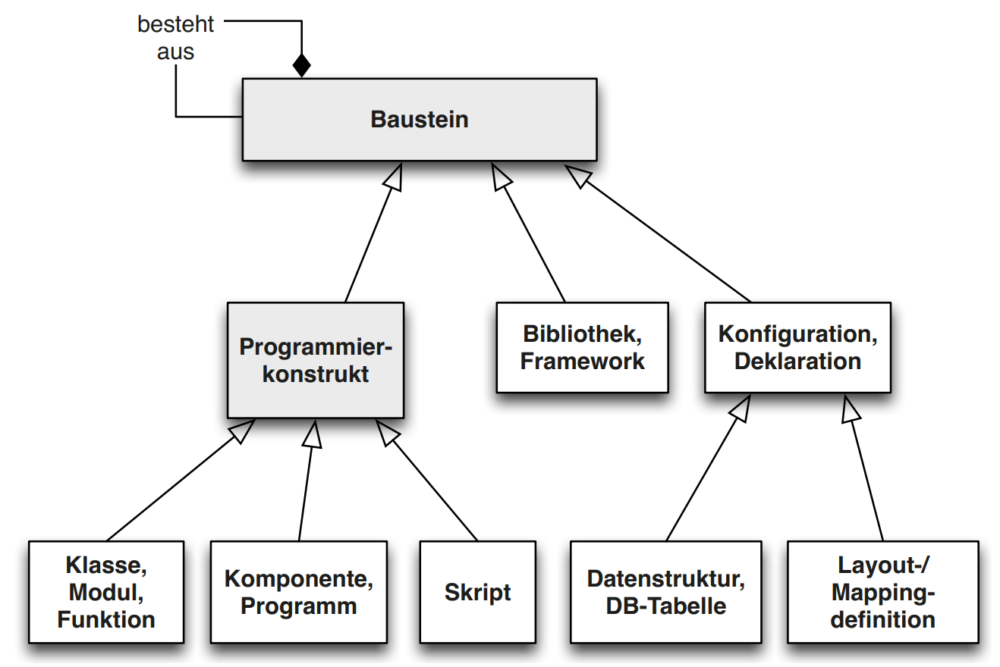

Ein (Super-)Baustein kann aus anderen (Sub-)Bausteinen bestehen und deren Beziehungen implementieren.

### Schnitstellen 

Eine Schnittstelle repräsentiert einen Zugangspunkt zu einem System oder dessen Baustein. Dabei beschreibt die Schnittstelle die Eigenschaften des Zugangspunktes (Attribute, Daten oder Funktionen).

Ziel ist es diese Eigenschaften möglichst präzise mit allen notwendigen Aspekten zu definieren wie z.B.:
- Syntax
- Datenstrukturen
- funktionales Verhalten
- Fehlerverhalten
- nichtfunktionale Eigenschaften
- Nutzungsprotokolle der Schnittstelle
- Technologien
- Randbedingungen
- Semantik

|Komponente und Schnittstellen | Wem gehört die Schnittstelle
| --- | --- |
|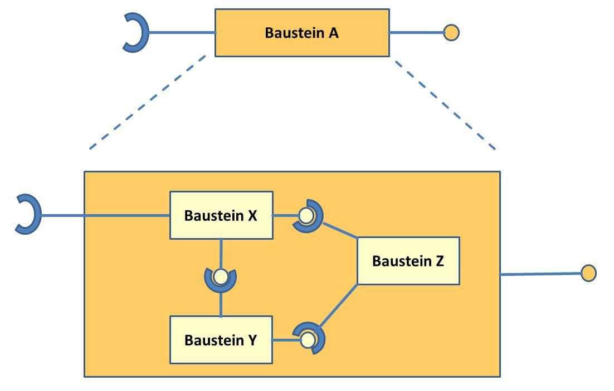| 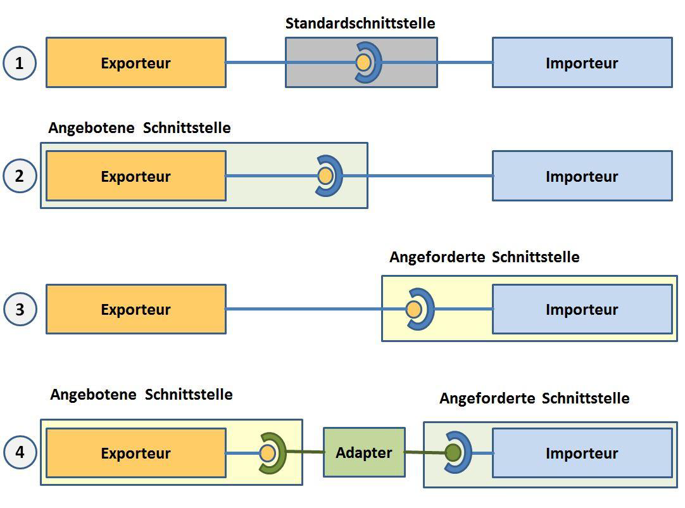 |

### Modularisierung 
Modularisierung = Zerlegung eines Systems in Teilsysteme (Bausteine)

Ziele
- Beherrschbarkeit von Komplexität
- Bessere Erweiterung und Wartbarkeit
- Bessere Veränderung
- Größere Wiederverwendbarkeit durch Rekombination von Modulen

Modul = Zusammenfassung von Operationen und Daten zur Realisierung einer abgeschlossenen Aufgabe
- Realisiert Geheimnisprinzip (Information Hiding)
- Single-Responsibility-Prinzip

Außenwelt kommuniziert über eindeutig definierte Schnittstelle mit dem Baustein (Exportschnittstelle)
- Exportschnittstelle gibt an, welche Operationen und Daten anderen Module zur Verfügung gestellt werden

Modul/Baustein hängt i.d.R von anderen Modulen ab (Importschnittstelle)
- Importschnittstelle gibt an, welche Operationen und Daten von anderen Modulen benötigt werden

## Entwurf von Softwarearchitekturen

Struktur von Software degeneriert mit der Zeit zu "verfaultem" Design.
Sympthome von "verfaultem" Design:
- Starrheit = Änderungen sind schwierig und führen zu Modifikationen an einer Vielzahl von Komponenten bzw. Klassen
- Zerbrechlichkeit = Änderungen an einer Stelle führen zu Fehlern an ganz anderen Stellen
- Schlechte Wiederverwendbarkeit = Komponenten besitzen viele Abhängigkeiten von Programmteilen, welche im neuen Kontext nicht benötigt werden


### Grundsätze

1. Stakeholder beurteilt Erfolg einer Lösung => Software ist nur gut wenn der Kunde zufrieden ist
2. Einfachheit gewinnt (KISS)
3. Es gibt kein Patentrezept zur Lösung beliebiger Probleme => Wie gut etwas ist wird sich erst mit der Zeit herausstellen
4. Voraussetzungen und Annahmen sollten explizit sein => Wenn etwas für mich klar ist muss es nicht für den Gegenüber klar sein
5. Erwarte Änderungen und Fehler!

### Grundprinzipien

- Strebe nach loser Kopplung
    - Kopplung durch Aufruf (Funktionsaufruf)
    - Kopplung durch Benachrichtigungen (Events o.ä.)
    - Kopplung durch Erzeugung
    - Kopplung durch Daten/Datenstrukturen
    - Kopplung über Zeit
- Strebe nach Kohäsion (Dichte des Bauteils => Zeigt wie gut Baustein ist)
- Trenne Verantwortlichkeiten
- Zerlege Systeme in Module => Modul = in sich geschlossener Baustein
- Nutze Abstraktion, Kapselung und Geheimnisprinzip
- Lösung soll konsistent sein (Nicht 4 verschiedene JSON-Parser sondern einer, welcher Projektweit genutzt wird)
- Vermeide Redundanz (DRY)
- Vermeide Zyklische Abhängigkeiten
> Beachte SOLID

### Wichtige Design-Pattern (für Architektur)
- Adapter
- Observer und MVC
- Decorator
- Proxy
- Fassade
- State
- Mediator (Bsp. API-Gateway/Broker)

## Beschreibung und Kommunikation von Software-Architekturen

| Darstellungsart | Beschreibungsmittel | Inhalt |
| --- | --- | --- |
| Kontextsicht(Kontextabgrenzung)| UML oder Kompositionsdiagramme evtl. Paketdiagramm <br> Listen von Nachbarsystemen und deren Schnittstellen | Inhalt = Beziehungen und Zusammenhänge mit dem Umfeld
|Bausteinsicht |UML-Komponenten und -Paketsymbole evtl. high Level Klassendiagramme|Statische Strukturen eines Softwaresystems <br>Beziehungen zwischen Bausteinen|
|Laufzeitsicht|UML-Aktivitätsdiagramme, -Kommunikationsdiagramme und -Sequenzdiagramme <br>evtl. Flussdiagramme, BPMN-Modelle|Zusammenwirken der Bausteine zur Laufzeit<br>Beziehungen zwischen Bausteinen|
|Verteilungs- und Infrastruktursicht|UML-Deploymentdiagramme<br>evtl. UML-Paket und -Komponentendiagramme|Technische Ablaufumgebung<br>Beziehungen zwischen Bausteinen|

## Bewertung von Softwarearchitekturen

### Qualitative Bewertung

ISO-Normen definieren Softwarequalität anhand von Merkmalen

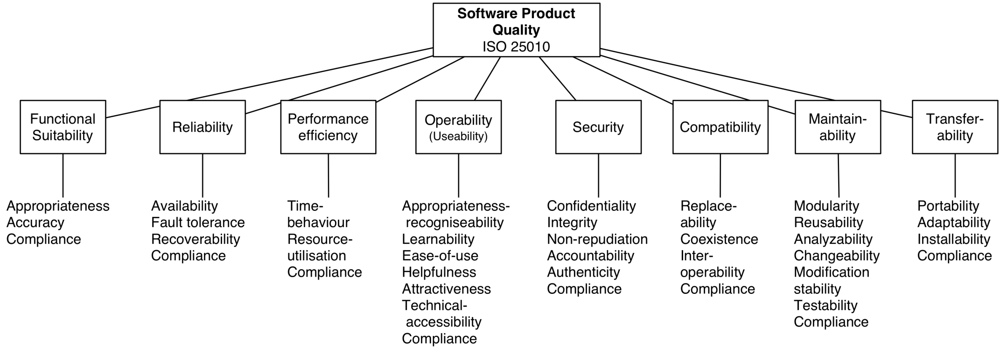

Beispiel für eine Solche Bewertung ist ATAM(Architecture Tradeoff Analysis Method)

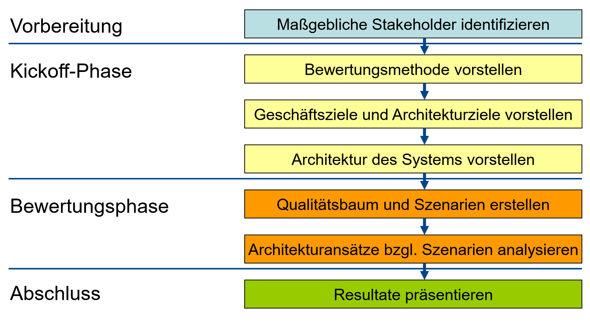

Weitere Verfahren:
- Technicher Durchstich (Klärung technischer Fragen)
- Prototypen
    - Wegwerfprototyp
    - Analyseprototyp (Proof of Concept)
    - Labormuster (Experiment zur Klärung konstruktionsbezogener Fragen)
    - Pilotsystem (Kern des zukünftigen Systems)

### Quantitative Bewertung 

Überprüfung von Architekturregeln und Bewertung anhand von Metriken
- Anforderungen
- Quellcode
- Erstellungsprozess einer Software
- Fehler
- Tests
- Design
- System


# Software Architektur Patterns

## Charakteristiken von Software Architektur Patterns

- Agilität
    - Wie gut kann auf Änderungen reagiert werden?
    - Wie invasiv sind Änderungen (Lokal/Global)
- Deployment
    - Aufwendigkeit des Deployments
- Testbarkeit
- Performance
    - Was sind die typischen Antwortzeiten? => Können diese einfach verbessert werden?
- Skalierbarkeit
    - Kann Anwendung über mehrere Rechner betrieben werden?
- Einfachheit
    - Ist das Programmiermodell komplex/einfach zu verstehen?
- Kosten

## Architekturvarianten

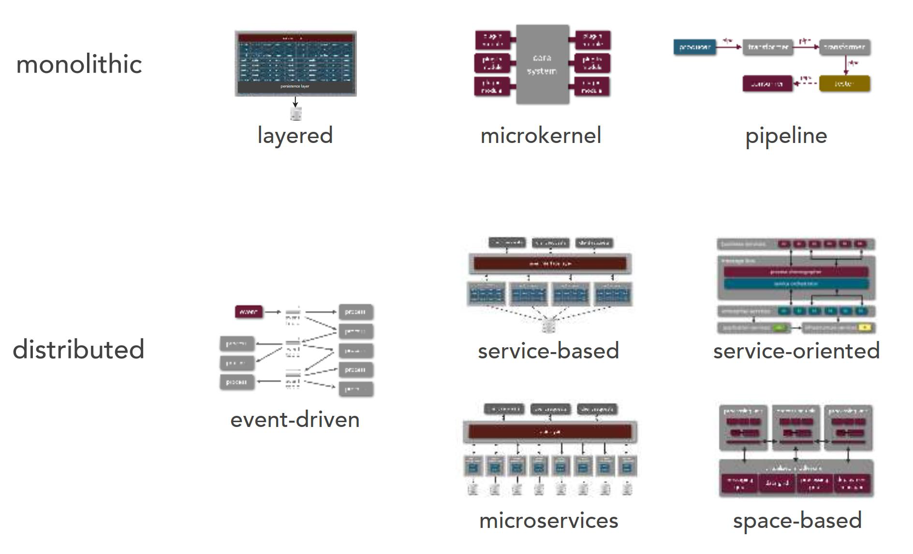

Unterteilung in Monolitische und verteilte Architekturen

In Realität kommen oft auch Hybridformen vor

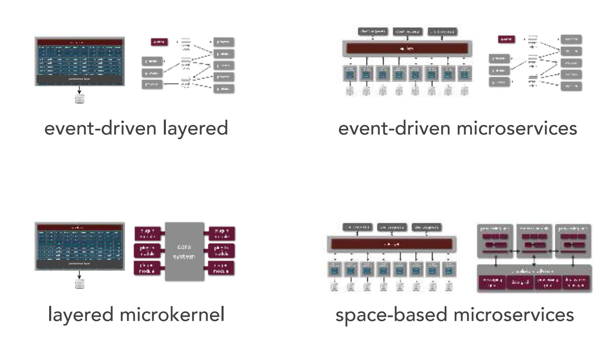


## Vor-/Nachteile Monolith vs. Verteilt

Verteilte Systeme sehr gut in:
- Performance
- Skalierung
- Verfügbarkeit

Dadurch entsteht jedoch Komplexität durch:
- Verteiltes Logging
- Verteilte Transaktionen
- Datentransfer
- Versionsmanagement

## Schichtenarchitektur

Komponenten werden in Horizontalen Schichten zusammengefasst. Dabei hat jede Schicht eine spezielle Verantwortung (Seperation of Concerns)

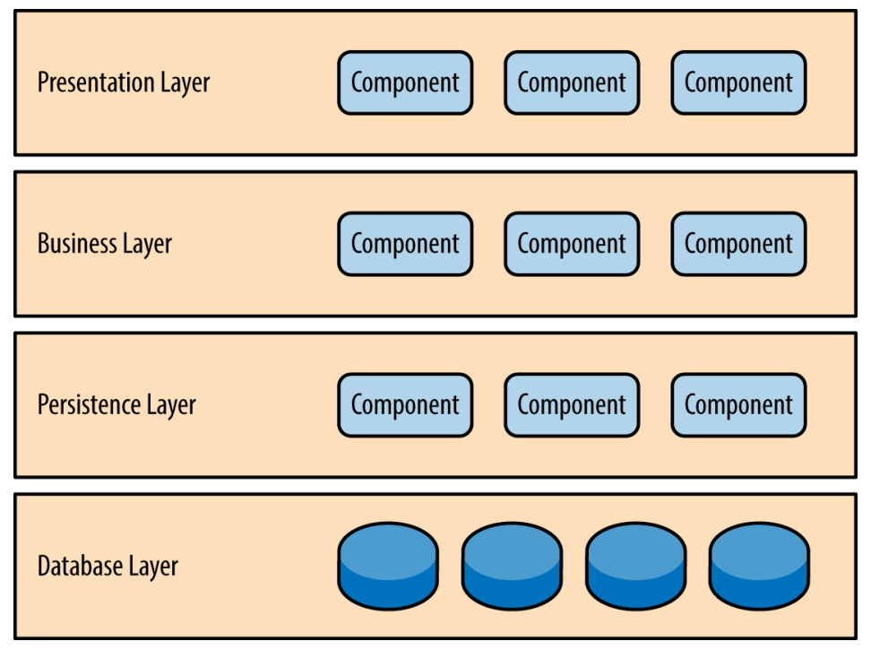

Das Schlüsselkonzept der Schichtenarchitektur ist Isolation => Jede Schicht kann ausgetauscht werden, da jede Schicht nur auf die Schicht direkt unter ihr zugreifen kann/soll.

Problem können durch "offene" Schichten entstehen => Schichten leiten direkt durch zur unteren Schicht
**Fast-Lane-Pattern**

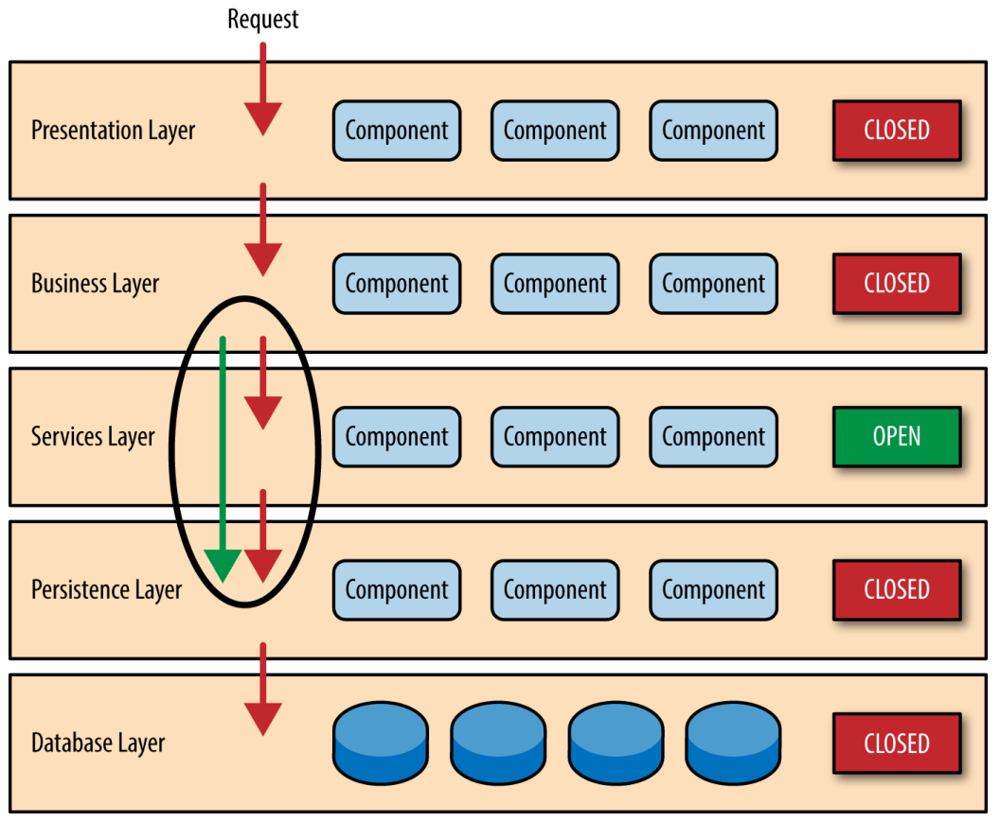

> Heuristik: **Max 20% der Aufrufe einer Schicht sollten lediglich den Aufruf delegieren**

Schichtenarchitektur führt zu technischer Trennung: UI-Designer, UI-Entwickler, Backend-Entwickler, DB-Experten, ...

Use-Cases für Schichtenarchitektur:
- Kleine einfache Anwendungen
- Web Anwendungen
- Techniche Proof of Concepts

## Pipe & Filter - Architektur

Besteht aus:
- Pipes = (unidirektionale) Kommunikationskanäle
- Filter = unabhängige (self-contained) Verarbeitungsprozesse
    - Producer = (Datenquelle/Startpunkt)
    - Transformer = Empfängt, verarbeitet und Sendet (input-transform-output)
    - Consumer = Endverarbeitung

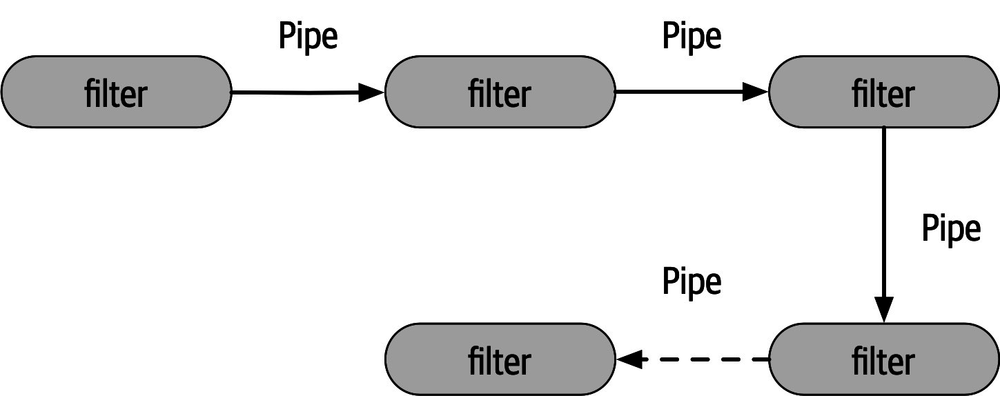


## Microkernel - Architektur

Hat den Sinn eine Kern-Anwendung beliebig um Plug-Ins erweitern zu können

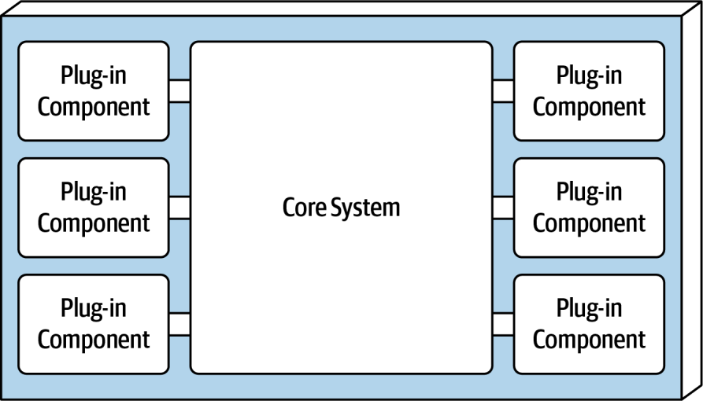

Besteht aus:
- Kern-System
- Plugin-Module

Bsp. Eclipse, FireFox, Chrome
=> Anwendungen die eine Basisfunktionalität bereitstellen und durch bestimtme Plug-Ins erweitert werden können
Zentrale Daten sollten nur über Core-System erreichbar sein

Es gibt auch eine verteilte Variante der Microkernel-Architektur

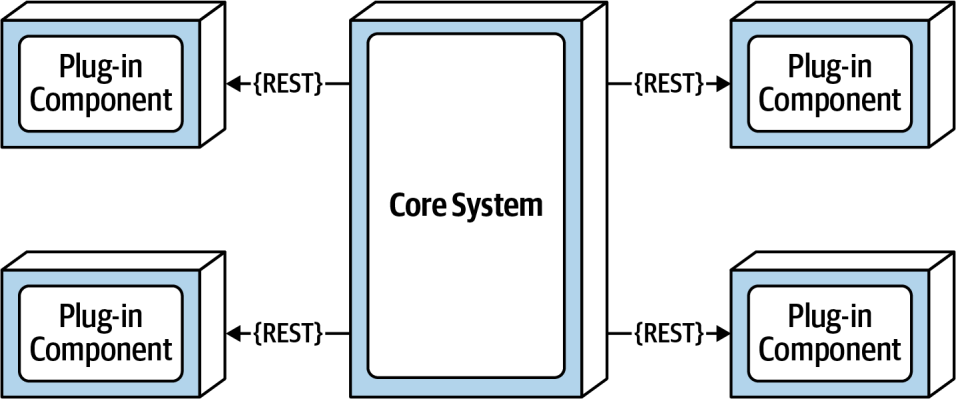


## Service-Based - Architektur

Variante der Microservices => pragmatischer Architekturstil
=> Services grobgranularer als Microservices

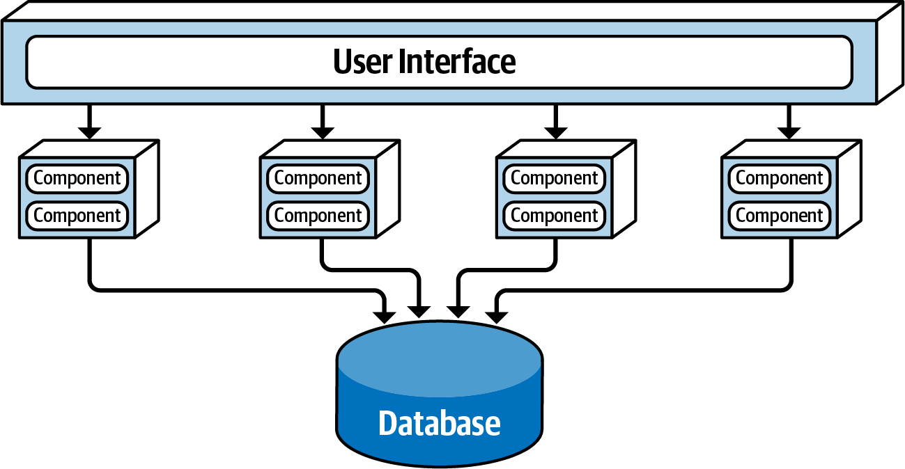


> Charakteristik = zentrale Datenbank
>> Nutzt ein Service exklusiv Daten können diese in einer eigenen Datenbank gehalten werden.

Es können 1 - Anzahl Services User Interfaces vorkommen

Architektur passt gut zu DDD-Ansatz

Transaktionsdesign ist "relativ" einfach, da durch die Verwendung einer zentralen Datenbank die ACID-Eigenschaften der Datenbank genutzt werden können

## Event Driven Architektur

Wird häufig für verteilte Asynchrone Verarbeitungsstrukturen verwendet


### Broker Topologie (vgl. Choreographie Pattern)

Hier wird die Datenverarbeitung von einzelnen unabhängigen Komponenten übernommen
=> Ablauf der Verarbeitung ist in Topologie verankert

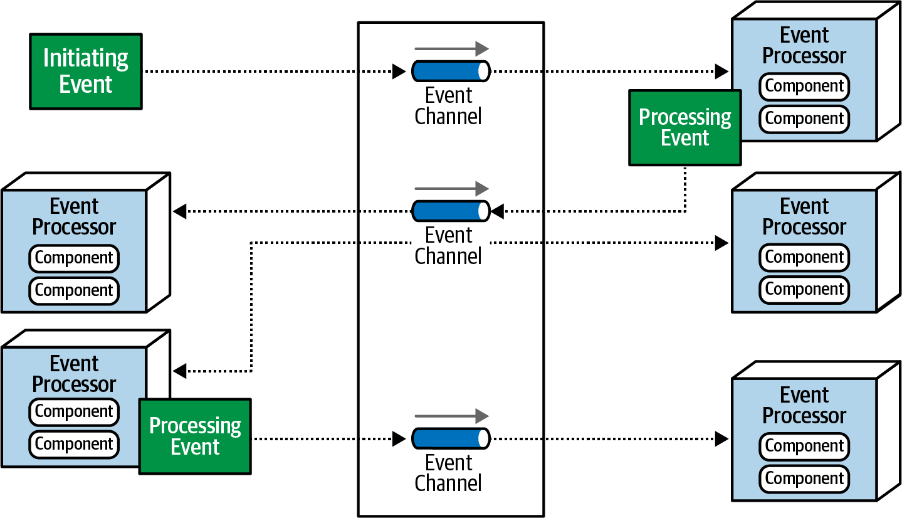


### Mediator Topologie (vgl. Orchestrations Pattern)

Mediator steuert den Verarbeitungsablauf

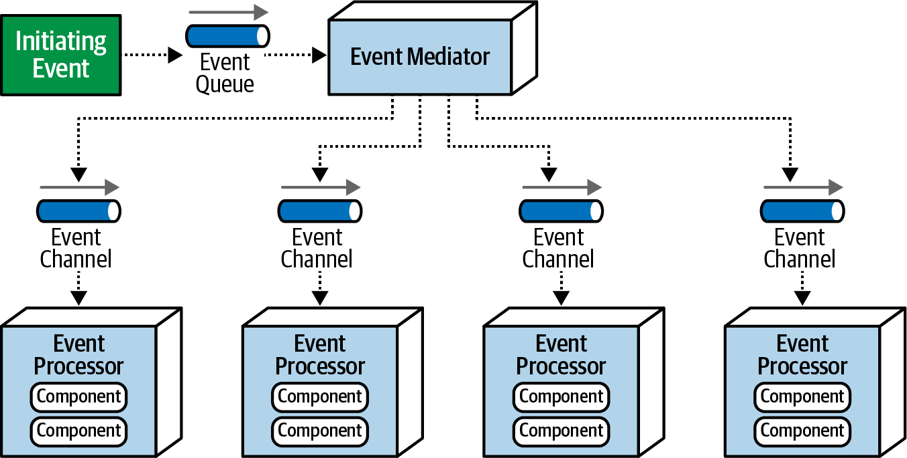


In der Eventdriven Architektur kommen Reply-Queues und Korrelations IDs zum Einsatz (Rückkanäle für Antworten in Topics)


### Space-Based Architektur

Space-Based Architektur nutzt Konzepte des Grid-Computings
=> Mehrere parallele Prozesse kommunizieren über gemeinsamen Speicher
=> Replizierte In-Memory Datengitter garantieren hohe Skalierbarkeit, Elastizität und hohe Leistung (Zugriff auf zentrale DB entfällt)

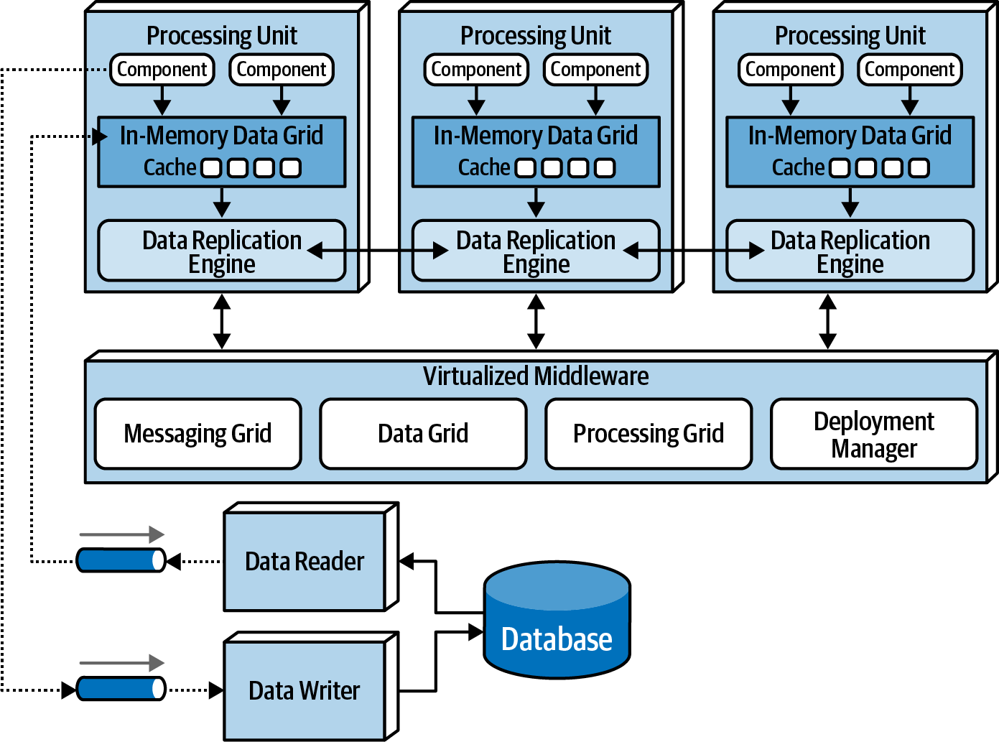

Typische Anwendungsfälle => Ticketverkauf, Auktionssysteme
Client stellt Request an Middleware

## Orchestrierte Serviceorientierte - Architektur
Konzentriert sich auf Wiederverwendung auf Unternehmensebene

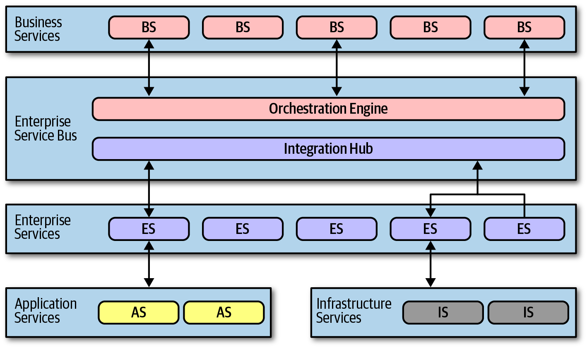


- Business Services: Grobkörnige Dienstleistungen, die auf dem allgemeinen Geschäftsverhalten basieren.
- Enterprise Services: Bausteine, aus denen sich die grobkörnigen Business Services zusammensetzen, die über die Orchestrierungs-Engine miteinander verknüpft. werden.
- Application Services: einmalige Implementierungen. Beispiel: Geolokalisierung, der nicht wiederverwendbar sein soll.
- Infrastructure Services: betriebliche Belange wie Monitoring, Logging, Authentifizierung, Autorisierung, etc.
- Orchestration Engine: Fügt Business-Service-Implementierungen durch Orchestrierung zusammen und übernimmt Funktionen wie Transaktionskoordination und Nachrichtentransformation.
- Idee: Geschäftsprozesse können jederzeit angepasst und verändert werden
    - Ohne das programmiert werden muss (Wiederverwendung)
    - Schnelle Reaktion auf neue Marktanforderungen (time-to-market)

## Microservice - Architektur

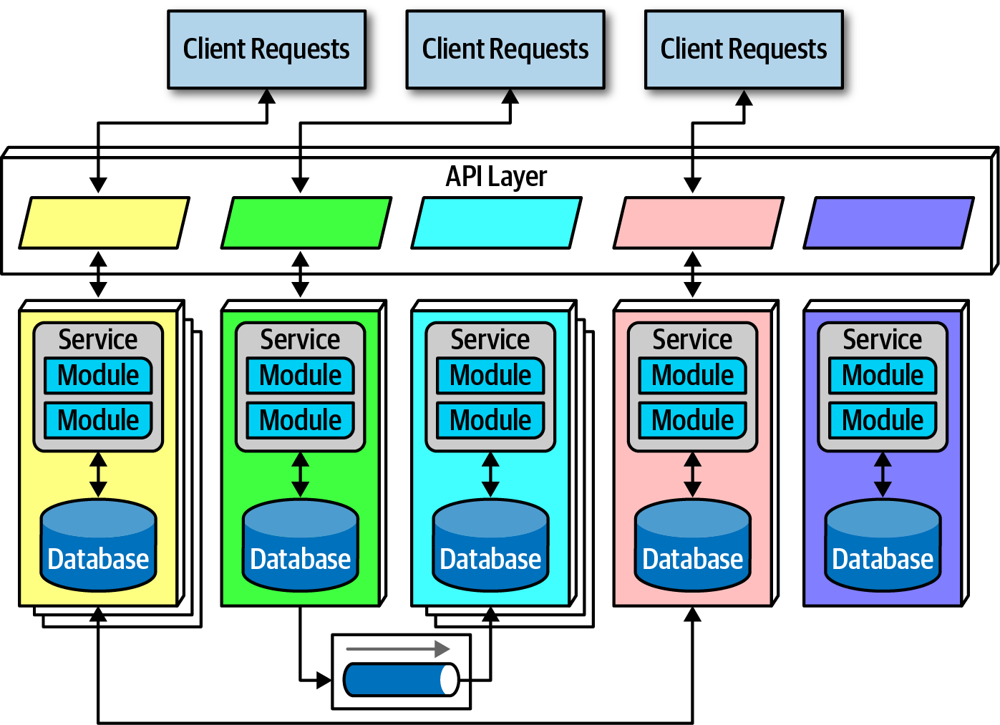

Philosophie von Microservices ist der Begriff: Bounded Context => Jeder Microservice modelliert Domäne/Workflow, außerdem Datenisolation

Microservice = isolierte "self-contained systems"

### Side Car Pattern

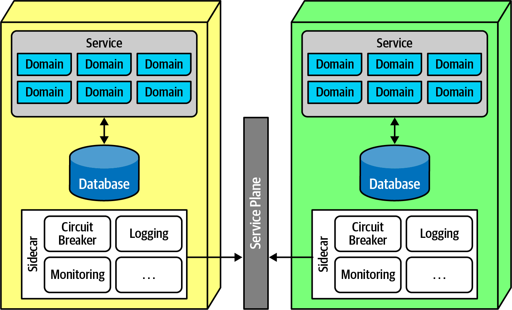

### SAGAs als Transaktionsmodell von Microservices

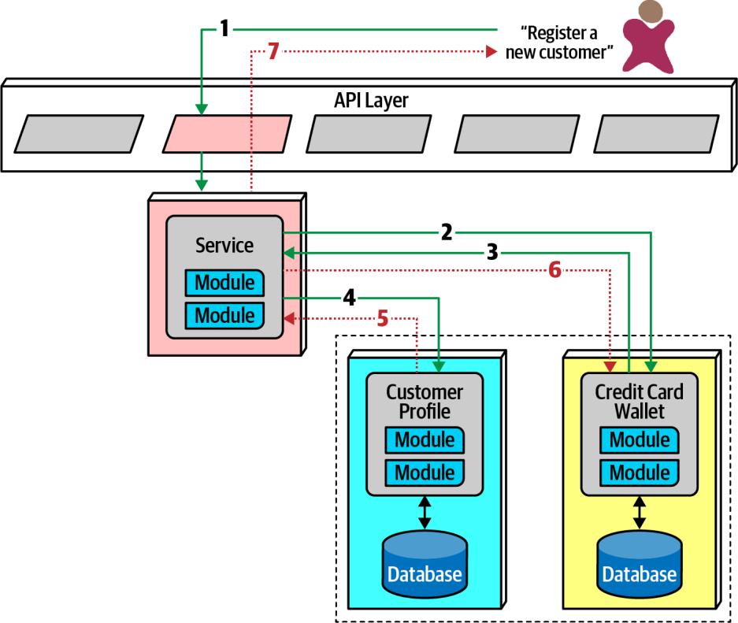


<br><br><br><br><br><br><br><br><br><br><br><br><br><br><br><br><br><br><br><br><br><br><br><br><br><br><br><br><br><br><br><br><br><br><br><br><br><br><br><br><br><br><br><br><br><br><br><br><br><br><br><br><br><br><br><br><br><br><br><br><br><br><br><br><br>

# Wahrscheinlich nicht Prüfungsrelevant aber interessant
API-Gateway = Früher. Session Dispatcher => Verteilt API-Anfragen auf die verteilten Backend-Dienste.


Dispatcher oder Gateway => Verantwortlich für die Verteilung der Last auf die verschiedenen Server

## Praktische Begriffe
Resilient = Wiederstandsfähig


[^1]: Fähigkeit, dass Funktionen oder Methoden in verschiedenen Objekten unterschiedlich ausgeführt werden können


